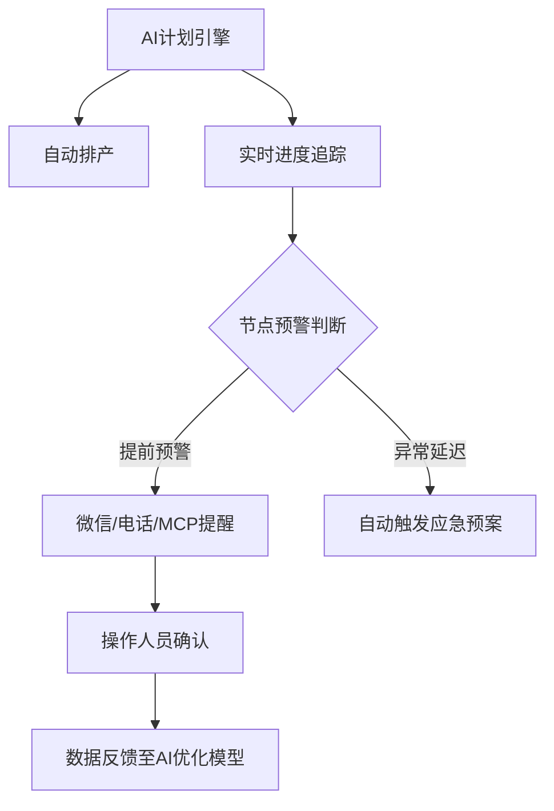

---

### **AI Agent驱动的PMC智能追踪系统开发方案**  
结合AI Agent与IDE开发一个具备 **自动计划排程、智能预警、闭环跟踪** 的PMC系统完全可行。以下是具体实现路径：

---

#### **一、系统核心功能设计**


**关键功能说明**：
1. **智能排产**  
   - 输入：订单数据、BOM、产能、库存 → 输出：最优生产计划（基于强化学习动态调整）
2. **多模态提醒**  
   - 普通节点：提前1天微信推送  
   - 关键节点（如物料到货）：提前3小时电话+短信  
   - 红色警报（影响交付）：自动发起钉钉/Teams会议
3. **闭环确认机制**  
   - 操作人员需在系统中点击「确认」或「延迟申报」  
   - 未响应时自动升级提醒（员工→主管→厂长）

---

#### **二、技术实现路径**
**1. 开发工具选型**  
| **模块**       | **推荐方案**                                                                 | **优势**                          |
|----------------|----------------------------------------------------------------------------|----------------------------------|
| **核心算法**   | Python + TensorFlow/PyTorch（LSTM时序预测+遗传算法排程）                     | 处理小家电多品种小批量特性          |
| **前端IDE**    | VSCode + Streamlit（快速构建可视化界面）                                     | 支持低代码拖拽排产                 |
| **通信接口**   | 企业微信API/阿里云MNS（消息推送） + Twilio（国际电话提醒）                    | 确保99%到达率                     |
| **数据中台**   | MySQL（结构化数据） + MongoDB（日志/非结构化数据）                           | 兼容现有ERP系统                   |

**2. AI Agent训练数据准备**  
```python
# 示例：生产延迟预警模型训练数据
import pandas as pd
training_data = pd.DataFrame({
    'task_id': ['T2024001', 'T2024002'], 
    'plan_start': ['2024-07-01 08:00', '2024-07-02 09:00'],
    'actual_start': ['2024-07-01 08:15', '2024-07-02 10:30'],  # 实际数据用于训练
    'delay_reason': ['物料未到货', '设备故障'],  # 用于归类延迟模式
    'alert_level': ['high', 'medium']  # 人工标注的预警等级
})
```

**3. 关键代码逻辑示例**  
```python
# 节点预警判断逻辑
def check_node_alert(node):
    remaining_time = node.deadline - datetime.now()
    if remaining_time < timedelta(hours=2):
        send_alert(node.responsible_person, method="phone", 
                  msg=f"紧急！{node.name}还剩{remaining_time}未完成")
    elif remaining_time < timedelta(days=1):
        send_alert(node.responsible_person, method="wechat", 
                  msg=f"提醒：请确认{node.name}进度")

# 与企业微信集成
def send_alert(user, method, msg):
    if method == "wechat":
        requests.post(WECHAT_API_URL, json={"userid": user, "content": msg})
    elif method == "phone":
        call = client.calls.create(
            to=user.phone, 
            from_=COMPANY_PHONE,
            twiml=f'<Response><Say>{msg}</Say></Response>'
        )
```

---

#### **三、小家电行业定制化设计**
1. **特殊场景处理**  
   - **模具准备预警**：在注塑工序开始前48小时自动检查模具状态  
   - **季节性物料**：根据历史数据预测电热管等需求，提前触发采购  
   - **ECN变更**：自动识别BOM变更影响的生产工单并重排计划

2. **硬件联动方案**  
   ```mermaid
   graph LR
   A[AI系统] -->|API| B[车间MES看板]
   A -->|IoT| C[注塑机状态监测]
   C -->|实时数据| A
   ```
   - 当注塑机停机超30分钟时，自动调整后续工序计划

---

#### **四、实施步骤与成本**
**1. 分阶段上线**  
| **阶段** | **时间** | **目标**                          | **交付物**                      |
|----------|----------|-----------------------------------|--------------------------------|
| 1.基础版 | 1个月    | 实现自动排产+微信提醒              | 可运行的单机版系统              |
| 2.增强版 | 2个月    | 接入企业微信+电话预警              | 部门级部署版本                  |
| 3.智能版 | 3个月    | 加入AI动态优化+IoT集成             | 全厂级智能PMC系统               |

**2. 成本估算**  
- **开发成本**：15-30万（含硬件对接）  
- **云服务年费**：约2万（消息推送+AI模型托管）  
- **硬件改造**：5-10万（车间数据采集设备）

---

#### **五、避坑指南**
1. **不要** 追求100%自动化，保留人工覆盖关键决策点（如插单审批）  
2. **务必** 先在小范围试运行（如选择1条产线验证）  
3. **警惕** 数据孤岛问题，提前与ERP/MES供应商确认API接口可用性  

> **效益预估**（基于行业案例）：  
> - 计划编制时间缩短70%  
> - 交付准时率提升至95%+  
> - 异常响应速度从小时级降至分钟级  

通过此系统，PMC人员可从繁琐的跟单工作中解放，专注异常处理和持续优化。需要原型DEMO或详细技术方案可进一步沟通。