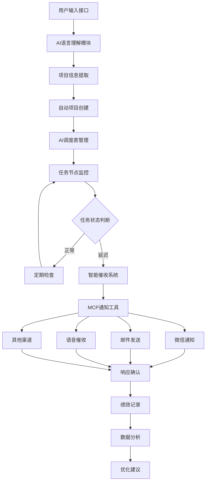

---

# AI驱动的自动PMC系统开发任务书

## 项目概述

本项目旨在开发一个AI驱动的自动PMC（生产计划与物料控制）系统，通过自然语言输入项目需求或会议纪要，AI自动创建项目管理体系，实现全流程自动化跟单、多渠道智能催收、实时绩效评定和全程记录追踪。

### 1. 智能项目创建与管理
- **自然语言输入处理**：用户通过对话窗口输入新项目需求或会议纪要
- **智能信息提取**：AI自动识别项目关键信息（参与人、部门、职务、联系方式、任务节点等）
- **自动项目建立**：在`S:\PG-PMC\AI调度表`下自动创建项目文件夹和管理表格
- **项目结构化管理**：建立项目档案、任务清单、时间节点、责任人分配等

### 2. 自动化跟单系统
- **任务节点监控**：实时跟踪各任务节点的完成状态
- **智能催收提醒**：根据任务紧急程度和延迟情况自动发送提醒
- **多级升级机制**：未响应时自动升级提醒（员工→主管→部门负责人）
- **异常预警处理**：识别潜在风险并提前预警

### 3. 多渠道通知系统（MCP工具集成）
- **微信通知**：日常任务提醒和进度更新
- **邮件系统**：正式通知和文档传递
- **语音催收**：紧急任务的电话提醒
- **其他渠道**：钉钉、Teams等企业通讯工具集成

### 4. 全程记录与追踪
- **项目全生命周期记录**：从立项到结项的完整过程记录
- **操作日志管理**：所有系统操作和人员响应的详细日志
- **数据可视化**：项目进度、任务完成率等可视化展示
- **历史数据分析**：为未来项目提供参考依据

### 5. 绩效评定系统
- **部门绩效评估**：基于任务完成率、响应速度等指标
- **个人绩效跟踪**：员工任务完成情况和效率评估
- **项目成功率分析**：项目按时完成率、质量评估等
- **改进建议生成**：基于数据分析提供优化建议

### 6. 应用程序调用
- **集成现有工具**：调用`S:\PG-PMC\project`中的应用程序
- **工作流自动化**：根据项目需要自动启动相关工具和流程
- **数据同步**：与现有ERP、MES等系统的数据交互

## 系统架构设计



### 核心模块说明

1. **AI语言理解模块**
   - 自然语言处理：识别项目需求、参与人信息、时间节点等
   - 实体抽取：提取关键信息（人员、部门、任务、时间等）
   - 意图识别：理解用户输入的具体需求和目标

2. **项目自动创建模块**
   - 项目模板生成：基于识别的信息自动生成项目结构
   - 文件夹创建：在AI调度表下建立项目目录
   - 表格生成：创建任务跟踪表、责任人清单等

3. **智能催收系统**
   - 任务状态监控：实时检查任务完成情况
   - 智能提醒策略：根据任务重要性和延迟程度选择提醒方式
   - 升级机制：自动升级未响应的提醒

4. **MCP工具集成**
   - 多渠道通知：集成微信、邮件、语音等通知方式
   - 统一接口：提供标准化的通知接口
   - 响应追踪：记录通知发送和响应情况

## 技术实现方案

### 1. 技术架构选型

| **模块**           | **技术方案**                                    | **说明**                                |
|---------------------|------------------------------------------------|----------------------------------------|
| **AI语言理解**      | Python + Transformers + spaCy                 | 自然语言处理和实体识别                  |
| **项目管理核心**    | Python + FastAPI + SQLAlchemy                 | 高性能API服务和数据库ORM               |
| **前端界面**        | Trae AI IDE + Streamlit                       | 集成开发环境和可视化界面               |
| **MCP工具集成**     | MCP协议 + 各类通知工具                        | 统一的工具调用接口                     |
| **数据存储**        | SQLite/PostgreSQL + JSON文件                  | 结构化数据和项目文件存储               |
| **任务调度**        | APScheduler + Celery                          | 定时任务和异步任务处理                 |
| **通知系统**        | 企业微信API + SMTP + 语音API                  | 多渠道通知能力                         |

### 2. 核心代码架构示例

```python
# 项目信息提取模块
class ProjectInfoExtractor:
    def __init__(self):
        self.nlp = spacy.load("zh_core_web_sm")
        
    def extract_project_info(self, text):
        """从会议纪要或需求文本中提取项目信息"""
        doc = self.nlp(text)
        
        project_info = {
            'participants': [],
            'departments': [],
            'tasks': [],
            'deadlines': [],
            'contacts': {}
        }
        
        # 实体识别和信息提取逻辑
        for ent in doc.ents:
            if ent.label_ == "PERSON":
                project_info['participants'].append(ent.text)
            elif ent.label_ == "ORG":
                project_info['departments'].append(ent.text)
                
        return project_info

# 自动项目创建模块
class AutoProjectCreator:
    def __init__(self, base_path="S:\\PG-PMC\\AI调度表"):
        self.base_path = base_path
        
    def create_project(self, project_info):
        """基于提取的信息自动创建项目"""
        project_id = self.generate_project_id()
        project_path = os.path.join(self.base_path, project_id)
        
        # 创建项目目录结构
        os.makedirs(project_path, exist_ok=True)
        
        # 生成项目管理表格
        self.create_task_table(project_path, project_info)
        self.create_contact_list(project_path, project_info)
        
        return project_id

# MCP通知系统集成
class MCPNotificationSystem:
    def __init__(self):
        self.mcp_tools = {
            'wechat': 'mcp.notification.wechat',
            'email': 'mcp.notification.email', 
            'voice': 'mcp.notification.voice'
        }
        
    async def send_notification(self, method, recipient, message, urgency="normal"):
        """通过MCP工具发送通知"""
        tool_name = self.mcp_tools.get(method)
        if tool_name:
            await self.call_mcp_tool(tool_name, {
                'recipient': recipient,
                'message': message,
                'urgency': urgency
            })
            
    async def escalate_notification(self, task, level=1):
        """升级通知机制"""
        escalation_chain = task.get_escalation_chain()
        if level < len(escalation_chain):
            recipient = escalation_chain[level]
            await self.send_notification(
                method="email" if level > 0 else "wechat",
                recipient=recipient,
                message=f"任务 {task.name} 需要您的关注",
                urgency="high" if level > 1 else "normal"
            )
```

## 项目实施计划

### 开发阶段规划

| **阶段** | **时间** | **核心功能**                        | **交付物**                          |
|----------|----------|-------------------------------------|------------------------------------|
| **第一阶段** | 4周 | AI语言理解 + 项目自动创建           | 基础版本：能够解析输入并创建项目     |
| **第二阶段** | 6周 | 任务监控 + 基础通知系统             | 增强版本：具备跟单和提醒功能         |
| **第三阶段** | 4周 | MCP工具集成 + 多渠道通知            | 完整版本：全渠道通知能力             |
| **第四阶段** | 4周 | 绩效评定 + 数据分析                 | 智能版本：完整的PMC管理系统          |
| **第五阶段** | 2周 | 系统优化 + 部署上线                 | 生产版本：可投入实际使用             |

### 技术实现重点

#### 第一阶段：AI语言理解与项目创建
- 实现自然语言处理模块
- 开发项目信息提取算法
- 建立项目模板和自动创建机制
- 完成基础的文件和目录管理

#### 第二阶段：任务监控与通知
- 开发任务状态监控系统
- 实现基础的提醒和催收功能
- 建立任务优先级和紧急程度判断机制
- 完成基础的用户响应确认功能

#### 第三阶段：MCP工具集成
- 集成微信通知MCP工具
- 集成邮件发送MCP工具
- 集成语音催收MCP工具
- 建立统一的通知接口和升级机制

#### 第四阶段：绩效分析与优化
- 开发绩效评定算法
- 实现数据可视化和报表生成
- 建立历史数据分析和优化建议系统
- 完成系统集成测试

### 资源需求估算

| **资源类型** | **需求** | **说明** |
|--------------|----------|----------|
| **开发人员** | 2-3人 | Python开发工程师、AI算法工程师 |
| **开发时间** | 20周 | 约5个月的开发周期 |
| **硬件资源** | 中等配置服务器 | 用于AI模型运行和数据处理 |
| **第三方服务** | MCP工具、通知服务 | 微信API、邮件服务、语音服务等 |

## 项目风险与应对

### 技术风险
1. **AI理解准确性**：自然语言处理可能存在理解偏差
   - 应对：建立人工审核机制，逐步优化模型
2. **MCP工具兼容性**：不同通知工具的集成复杂度
   - 应对：分阶段集成，先实现核心功能
3. **系统性能**：大量并发任务监控的性能问题
   - 应对：采用异步处理和任务队列机制

### 业务风险
1. **用户接受度**：员工对AI系统的接受程度
   - 应对：充分的培训和逐步推广
2. **数据安全**：项目信息和联系方式的安全保护
   - 应对：实施严格的数据加密和访问控制

## 预期效果

### 效率提升
- **项目创建时间**：从手工30分钟缩短至AI自动3分钟
- **跟单效率**：24小时自动监控，及时发现问题
- **通知到达率**：多渠道确保95%以上的通知到达率
- **响应速度**：从小时级提升至分钟级响应

### 管理优化
- **全程可追溯**：完整的项目执行记录
- **数据驱动决策**：基于历史数据的绩效分析
- **标准化流程**：统一的项目管理流程
- **智能预警**：提前识别项目风险

## 项目总结

本AI驱动的自动PMC系统将彻底改变传统的项目管理模式，通过智能化的项目创建、自动化的跟单催收、多渠道的通知系统和数据驱动的绩效评定，实现PMC工作的全面数字化转型。

系统的核心价值在于：
1. **解放人力**：将PMC人员从繁琐的跟单工作中解放出来
2. **提升效率**：大幅提高项目管理和执行效率
3. **降低风险**：通过智能预警和多级提醒降低项目风险
4. **数据驱动**：基于数据分析持续优化管理流程

通过分阶段实施，确保系统稳定可靠，最终实现小家电生产企业PMC工作的智能化升级。
