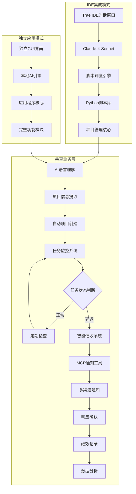

---

# PMC全流程图表界面应用软件开发任务书

## 项目概述

本项目旨在开发一套完整的图表界面PMC管理应用软件，基于BD400原始订单表和现有PMC工作流程，实现从订单接收到产品交付的全流程可视化管理，集成微信、手机、邮件的自动跟进与催办功能，为小家电生产企业提供现代化的PMC控制解决方案。

### 1. 智能项目创建与管理
- **自然语言输入处理**：用户通过对话窗口输入新项目需求或会议纪要
- **智能信息提取**：AI自动识别项目关键信息（参与人、部门、职务、联系方式、任务节点等）
- **自动项目建立**：在`S:\PG-PMC\AI调度表`下自动创建项目文件夹和管理表格
- **项目结构化管理**：建立项目档案、任务清单、时间节点、责任人分配等

### 2. 自动化跟单系统
- **任务节点监控**：实时跟踪各任务节点的完成状态
- **智能催收提醒**：根据任务紧急程度和延迟情况自动发送提醒
- **多级升级机制**：未响应时自动升级提醒（员工→主管→部门负责人）
- **异常预警处理**：识别潜在风险并提前预警

### 3. 多渠道通知系统（MCP工具集成）
- **微信通知**：日常任务提醒和进度更新
- **邮件系统**：正式通知和文档传递
- **语音催收**：紧急任务的电话提醒
- **其他渠道**：钉钉、Teams等企业通讯工具集成

### 4. 全程记录与追踪
- **项目全生命周期记录**：从立项到结项的完整过程记录
- **操作日志管理**：所有系统操作和人员响应的详细日志
- **数据可视化**：项目进度、任务完成率等可视化展示
- **历史数据分析**：为未来项目提供参考依据

### 5. 绩效评定系统
- **部门绩效评估**：基于任务完成率、响应速度等指标
- **个人绩效跟踪**：员工任务完成情况和效率评估
- **项目成功率分析**：项目按时完成率、质量评估等
- **改进建议生成**：基于数据分析提供优化建议

### 6. 应用程序调用
- **集成现有工具**：调用`S:\PG-PMC\project`中的应用程序
- **工作流自动化**：根据项目需要自动启动相关工具和流程
- **数据同步**：与现有ERP、MES等系统的数据交互

## 系统架构设计

### 双模式架构概览

本系统采用**IDE集成优先**的双模式架构设计，确保从开发到部署的平滑过渡：



### 架构特点

1. **IDE集成优先**：主要工作模式，通过Trae IDE与Claude对话完成任务
2. **脚本化执行**：用户输入需求，AI自动调用相应脚本完成工作
3. **共享业务核心**：两种模式共享核心业务逻辑，确保功能一致性
4. **渐进式演进**：从IDE模式验证功能，成熟后打包为独立应用

### 核心模块说明

#### IDE集成模式核心模块

1. **脚本调度引擎**
   - 对话解析：解析用户在Trae IDE中的自然语言输入
   - 意图识别：识别用户需求类型（创建项目、查看进度、发送通知等）
   - 脚本路由：根据意图自动调用相应的Python脚本
   - 执行监控：监控脚本执行状态并反馈结果

2. **Python脚本库**
   - 项目创建脚本：`create_project.py` - 自动创建项目结构
   - 任务监控脚本：`monitor_tasks.py` - 检查任务状态
   - 通知发送脚本：`send_notifications.py` - 多渠道通知
   - 数据分析脚本：`analyze_performance.py` - 生成绩效报告

#### 共享业务模块

3. **AI语言理解模块**
   - 自然语言处理：识别项目需求、参与人信息、时间节点等
   - 实体抽取：提取关键信息（人员、部门、任务、时间等）
   - 意图识别：理解用户输入的具体需求和目标

4. **项目自动创建模块**
   - 项目模板生成：基于识别的信息自动生成项目结构
   - 文件夹创建：在AI调度表下建立项目目录
   - 表格生成：创建任务跟踪表、责任人清单等

5. **智能催收系统**
   - 任务状态监控：实时检查任务完成情况
   - 智能提醒策略：根据任务重要性和延迟程度选择提醒方式
   - 升级机制：自动升级未响应的提醒

6. **MCP工具集成**
   - 多渠道通知：集成微信、邮件、语音等通知方式
   - 统一接口：提供标准化的通知接口
   - 响应追踪：记录通知发送和响应情况

## 技术实现方案

### 1. 双模式技术架构选型

#### IDE集成模式技术栈

| **模块**           | **技术方案**                                    | **说明**                                |
|---------------------|------------------------------------------------|----------------------------------------|
| **AI对话引擎**      | Claude-4-Sonnet（Trae IDE内置）               | 自然语言理解和对话处理                  |
| **脚本执行环境**    | Python 3.9+ + Trae IDE API                   | 轻量级脚本执行和文件操作               |
| **核心库**          | pathlib + json + datetime + sqlite3          | 基础功能库，无需额外依赖               |
| **MCP工具集成**     | Trae IDE原生MCP协议支持                       | 直接调用IDE内置工具                    |
| **数据存储**        | JSON文件 + SQLite                            | 轻量级本地存储                         |
| **任务调度**        | Python threading + schedule                   | 简化的定时任务处理                     |

#### 独立应用模式技术栈

| **模块**           | **技术方案**                                    | **说明**                                |
|---------------------|------------------------------------------------|----------------------------------------|
| **AI语言理解**      | Python + Transformers + spaCy                 | 完整的NLP处理能力                      |
| **项目管理核心**    | Python + FastAPI + SQLAlchemy                 | 高性能API服务和数据库ORM               |
| **前端界面**        | Streamlit / Tkinter                           | 独立的用户界面                         |
| **MCP工具集成**     | MCP协议 + 各类通知工具                        | 统一的工具调用接口                     |
| **数据存储**        | SQLite/PostgreSQL + JSON文件                  | 结构化数据和项目文件存储               |
| **任务调度**        | APScheduler + Celery                          | 定时任务和异步任务处理                 |
| **通知系统**        | 企业微信API + SMTP + 语音API                  | 多渠道通知能力                         |

### 2. 核心代码架构示例

#### IDE集成模式 - 脚本调度引擎

```python
# script_dispatcher.py - IDE集成模式核心调度器
class IDEScriptDispatcher:
    def __init__(self, workspace_path: str):
        self.workspace_path = Path(workspace_path)
        self.scripts_dir = self.workspace_path / "scripts"
        self.data_dir = self.workspace_path / "data"
        self.config = self._load_config()
    
    def process_user_input(self, user_message: str) -> dict:
        """处理用户在IDE中的输入，返回执行结果"""
        # 解析用户意图
        intent = self._parse_intent(user_message)
        
        # 根据意图调用相应脚本
        if intent["action"] == "create_project":
            return self._execute_script("create_project.py", intent["params"])
        elif intent["action"] == "check_status":
            return self._execute_script("monitor_tasks.py", intent["params"])
        elif intent["action"] == "send_notification":
            return self._execute_script("send_notifications.py", intent["params"])
        else:
            return {"error": "未识别的操作类型"}
    
    def _parse_intent(self, message: str) -> dict:
        """简化的意图识别（基于关键词匹配）"""
        if any(keyword in message for keyword in ["创建项目", "新建", "开始"]):
            return {
                "action": "create_project",
                "params": self._extract_project_params(message)
            }
        elif any(keyword in message for keyword in ["查看", "状态", "进度"]):
            return {
                "action": "check_status",
                "params": self._extract_query_params(message)
            }
        elif any(keyword in message for keyword in ["通知", "提醒", "催收"]):
            return {
                "action": "send_notification",
                "params": self._extract_notification_params(message)
            }
        return {"action": "unknown", "params": {}}
    
    def _execute_script(self, script_name: str, params: dict) -> dict:
        """执行指定脚本并返回结果"""
        script_path = self.scripts_dir / script_name
        try:
            # 动态导入并执行脚本
            spec = importlib.util.spec_from_file_location("script", script_path)
            module = importlib.util.module_from_spec(spec)
            spec.loader.exec_module(module)
            
            # 调用脚本主函数
            if hasattr(module, "main"):
                return module.main(params)
            else:
                return {"error": f"脚本 {script_name} 缺少main函数"}
        except Exception as e:
            return {"error": f"执行脚本失败: {str(e)}"}
```

#### 独立应用模式 - 项目信息提取器

```python
# 项目信息提取模块（用于独立应用模式）
class ProjectInfoExtractor:
    def __init__(self):
        self.nlp = spacy.load("zh_core_web_sm")
        
    def extract_project_info(self, text):
        """从会议纪要或需求文本中提取项目信息"""
        doc = self.nlp(text)
        
        project_info = {
            'participants': [],
            'departments': [],
            'tasks': [],
            'deadlines': [],
            'contacts': {}
        }
        
        # 实体识别和信息提取逻辑
        for ent in doc.ents:
            if ent.label_ == "PERSON":
                project_info['participants'].append(ent.text)
            elif ent.label_ == "ORG":
                project_info['departments'].append(ent.text)
                
        return project_info

#### IDE模式 - 项目创建脚本

```python
# scripts/create_project.py - IDE模式轻量化项目创建
import json
import os
from datetime import datetime
from pathlib import Path

def main(params: dict) -> dict:
    """IDE模式项目创建主函数"""
    try:
        # 从参数中提取项目信息
        project_name = params.get("project_name", "未命名项目")
        participants = params.get("participants", [])
        deadline = params.get("deadline", "")
        description = params.get("description", "")
        
        # 创建项目目录
        workspace_path = Path(os.getcwd())
        projects_dir = workspace_path / "AI调度表"
        project_path = projects_dir / project_name
        
        project_path.mkdir(parents=True, exist_ok=True)
        
        # 生成项目配置文件
        project_config = {
            "name": project_name,
            "created_at": datetime.now().isoformat(),
            "participants": participants,
            "deadline": deadline,
            "description": description,
            "status": "进行中",
            "tasks": []
        }
        
        config_file = project_path / "project_config.json"
        with open(config_file, 'w', encoding='utf-8') as f:
            json.dump(project_config, f, ensure_ascii=False, indent=2)
        
        # 创建项目概述文档
        create_project_overview(project_path, project_config)
        
        # 创建任务跟踪表
        create_task_tracker(project_path, project_config)
        
        return {
            "success": True,
            "message": f"项目 '{project_name}' 创建成功",
            "project_path": str(project_path)
        }
        
    except Exception as e:
        return {
            "success": False,
            "error": f"项目创建失败: {str(e)}"
        }

def create_project_overview(project_path: Path, config: dict):
    """创建项目概述文档"""
    overview_file = project_path / "项目概述.md"
    with open(overview_file, 'w', encoding='utf-8') as f:
        f.write(f"# {config['name']}\n\n")
        f.write(f"**创建时间**: {config['created_at'][:10]}\n")
        f.write(f"**截止日期**: {config['deadline']}\n")
        f.write(f"**项目状态**: {config['status']}\n\n")
        f.write(f"## 项目描述\n{config['description']}\n\n")
        f.write(f"## 参与人员\n")
        for person in config['participants']:
            f.write(f"- {person}\n")

def create_task_tracker(project_path: Path, config: dict):
    """创建任务跟踪表"""
    tracker_file = project_path / "任务跟踪.md"
    with open(tracker_file, 'w', encoding='utf-8') as f:
        f.write(f"# {config['name']} - 任务跟踪\n\n")
        f.write("| 任务名称 | 负责人 | 开始时间 | 截止时间 | 状态 | 备注 |\n")
        f.write("|----------|--------|----------|----------|------|------|\n")
        f.write("| 待添加任务 | - | - | - | 待分配 | - |\n")
```

#### 独立应用模式 - 自动项目创建器

```python
# 保留完整功能的项目创建器（用于独立应用模式）
class AutoProjectCreator:
    def __init__(self, base_path="S:\\PG-PMC\\AI调度表"):
        self.base_path = base_path
        
    def create_project(self, project_info):
        """基于提取的信息自动创建项目"""
        project_id = self.generate_project_id()
        project_path = os.path.join(self.base_path, project_id)
        
        # 创建项目目录结构
        os.makedirs(project_path, exist_ok=True)
        
        # 生成项目管理表格
        self.create_task_table(project_path, project_info)
        self.create_contact_list(project_path, project_info)
        
        return project_id
```

#### IDE模式 - MCP通知脚本

```python
# scripts/send_notifications.py - IDE模式通知发送
import json
from datetime import datetime
from pathlib import Path

def main(params: dict) -> dict:
    """IDE模式通知发送主函数"""
    try:
        message = params.get("message", "")
        recipients = params.get("recipients", [])
        channels = params.get("channels", ["email"])
        project_name = params.get("project_name", "")
        
        results = []
        
        # 通过MCP工具发送通知
        for channel in channels:
            for recipient in recipients:
                if channel == "email":
                    result = send_email_notification(message, recipient)
                elif channel == "wechat":
                    result = send_wechat_notification(message, recipient)
                else:
                    result = {"status": "unsupported", "channel": channel}
                
                results.append({
                    "channel": channel,
                    "recipient": recipient,
                    "result": result
                })
        
        # 记录通知日志
        log_notification(project_name, message, recipients, channels, results)
        
        return {
            "success": True,
            "message": "通知发送完成",
            "results": results
        }
        
    except Exception as e:
        return {
            "success": False,
            "error": f"通知发送失败: {str(e)}"
        }

def send_email_notification(message: str, recipient: str) -> dict:
    """发送邮件通知（通过MCP工具）"""
    # 这里将调用Trae IDE的MCP邮件工具
    # 实际实现时需要根据具体的MCP工具接口调整
    return {
        "status": "sent",
        "timestamp": datetime.now().isoformat(),
        "method": "email"
    }

def send_wechat_notification(message: str, recipient: str) -> dict:
    """发送微信通知（通过MCP工具）"""
    # 这里将调用Trae IDE的MCP微信工具
    return {
        "status": "sent",
        "timestamp": datetime.now().isoformat(),
        "method": "wechat"
    }

def log_notification(project_name: str, message: str, recipients: list, channels: list, results: list):
    """记录通知日志"""
    log_entry = {
        "timestamp": datetime.now().isoformat(),
        "project": project_name,
        "message": message,
        "recipients": recipients,
        "channels": channels,
        "results": results
    }
    
    # 保存到日志文件
    log_file = Path("data/notification_logs.json")
    log_file.parent.mkdir(exist_ok=True)
    
    logs = []
    if log_file.exists():
        with open(log_file, 'r', encoding='utf-8') as f:
            logs = json.load(f)
    
    logs.append(log_entry)
    
    with open(log_file, 'w', encoding='utf-8') as f:
        json.dump(logs, f, ensure_ascii=False, indent=2)
```

#### 独立应用模式 - MCP通知系统集成

```python
# 保留完整功能的通知系统（用于独立应用模式）
class MCPNotificationSystem:
    def __init__(self):
        self.mcp_tools = {
            'wechat': 'mcp.notification.wechat',
            'email': 'mcp.notification.email', 
            'voice': 'mcp.notification.voice'
        }
        
    async def send_notification(self, method, recipient, message, urgency="normal"):
        """通过MCP工具发送通知"""
        tool_name = self.mcp_tools.get(method)
        if tool_name:
            await self.call_mcp_tool(tool_name, {
                'recipient': recipient,
                'message': message,
                'urgency': urgency
            })
            
    async def escalate_notification(self, task, level=1):
        """升级通知机制"""
        escalation_chain = task.get_escalation_chain()
        if level < len(escalation_chain):
            recipient = escalation_chain[level]
            await self.send_notification(
                method="email" if level > 0 else "wechat",
                recipient=recipient,
                message=f"任务 {task.name} 需要您的关注",
                urgency="high" if level > 1 else "normal"
            )
```

## 项目实施计划

### 总体策略：IDE集成优先的渐进式开发

本项目采用**IDE集成模式优先**的开发策略，先在Trae IDE环境中验证核心功能，再逐步演进为独立应用。

### 开发阶段规划

| **阶段** | **时间** | **模式** | **核心功能** | **交付物** |
|----------|----------|----------|-------------|------------|
| **第一阶段** | 2周 | IDE集成 | 脚本调度引擎 + 基础脚本库 | IDE集成的脚本调度系统 |
| **第二阶段** | 3周 | IDE集成 | 核心功能脚本完善 | 完整的项目管理脚本 |
| **第三阶段** | 3周 | IDE集成 | 智能化功能开发 | 增强的AI理解和智能催收 |
| **第四阶段** | 2周 | IDE集成 | 系统优化与测试 | 优化的IDE集成系统 |
| **第五阶段** | 4周 | 独立应用 | 独立应用开发 | 独立的PMC应用程序 |

### 技术实现重点

#### 第一阶段：脚本调度引擎与基础脚本库
- 开发IDE脚本调度引擎（IDEScriptDispatcher）
- 建立基础Python脚本库结构
- 实现用户输入解析和脚本路由机制
- 完成基础的项目创建脚本

#### 第二阶段：核心功能脚本完善
- 完善项目创建脚本（create_project.py）
- 开发任务监控脚本（monitor_tasks.py）
- 实现通知发送脚本（send_notifications.py）
- 建立数据存储和日志记录机制

#### 第三阶段：智能化功能开发
- 集成Trae IDE的AI对话引擎
- 开发智能催收逻辑
- 实现MCP工具集成
- 建立智能决策和升级机制

#### 第四阶段：系统优化与测试
- 性能优化和错误处理
- 用户体验优化
- 全面测试和调试
- 文档完善和使用指南

#### 第五阶段：独立应用开发
- 基于IDE模式的核心逻辑
- 开发独立的用户界面
- 实现完整的AI语言理解模块
- 系统打包和部署准备

### 资源需求估算

#### IDE集成模式（第1-4阶段）

| **资源类型** | **需求** | **说明** |
|--------------|----------|----------|
| **开发人员** | 1-2人 | Python脚本开发工程师 |
| **开发时间** | 10周 | 约2.5个月的IDE集成开发 |
| **硬件资源** | 开发机器 | 利用Trae IDE内置AI引擎 |
| **第三方服务** | MCP工具 | 利用IDE内置MCP协议支持 |

#### 独立应用模式（第5阶段）

| **资源类型** | **需求** | **说明** |
|--------------|----------|----------|
| **开发人员** | 2-3人 | 全栈开发工程师、AI算法工程师 |
| **开发时间** | 4周 | 基于IDE模式核心逻辑快速开发 |
| **硬件资源** | 中等配置服务器 | 用于AI模型运行和数据处理 |
| **第三方服务** | AI模型、通知服务 | 独立的AI服务、微信API、邮件服务等 |

## 项目风险与应对

### IDE集成模式风险（第1-4阶段）

#### 技术风险
1. **IDE依赖性**：过度依赖Trae IDE环境
   - 应对：设计模块化架构，核心逻辑与IDE解耦
2. **脚本执行稳定性**：Python脚本在IDE环境中的稳定性
   - 应对：充分测试，建立错误处理和日志机制
3. **MCP协议兼容性**：IDE内置MCP工具的兼容性问题
   - 应对：优先使用成熟的MCP工具，建立备用方案

#### 业务风险
1. **用户学习成本**：用户需要熟悉IDE操作
   - 应对：提供详细的使用指南和培训
2. **功能局限性**：IDE模式功能相对简化
   - 应对：确保核心功能完整，为独立应用做准备

### 独立应用模式风险（第5阶段）

#### 技术风险
1. **AI理解准确性**：自然语言处理可能存在理解偏差
   - 应对：基于IDE模式验证的逻辑，降低开发风险
2. **系统性能**：大量并发任务监控的性能问题
   - 应对：采用异步处理和任务队列机制

#### 业务风险
1. **用户接受度**：从IDE模式向独立应用的迁移
   - 应对：保持操作习惯一致性，平滑过渡
2. **数据安全**：项目信息和联系方式的安全保护
   - 应对：实施严格的数据加密和访问控制

## 预期效果

### IDE集成模式效果（第1-4阶段）

#### 快速验证与迭代
- **开发周期缩短**：从20周缩短至10周，快速验证核心功能
- **学习成本降低**：利用现有IDE环境，减少用户学习负担
- **即时反馈**：通过AI对话获得即时的系统响应和调整
- **灵活调整**：脚本化执行便于快速修改和优化

#### 核心功能验证
- **项目创建自动化**：通过脚本实现3分钟内完成项目创建
- **智能催收验证**：验证AI理解和自动催收逻辑的有效性
- **通知系统测试**：验证MCP工具集成的稳定性和可靠性
- **流程标准化**：建立标准化的PMC管理流程模板

### 独立应用模式效果（第5阶段）

#### 效率提升
- **项目创建时间**：从手工30分钟缩短至AI自动3分钟
- **跟单效率**：24小时自动监控，及时发现问题
- **通知到达率**：多渠道确保95%以上的通知到达率
- **响应速度**：从小时级提升至分钟级响应

#### 管理优化
- **全程可追溯**：完整的项目执行记录
- **数据驱动决策**：基于历史数据的绩效分析
- **标准化流程**：统一的项目管理流程
- **智能预警**：提前识别项目风险

## 项目总结

本AI驱动的自动PMC系统采用**IDE集成优先的渐进式开发策略**，将彻底改变传统的项目管理模式。通过先在Trae IDE环境中验证核心功能，再演进为独立应用，实现PMC工作的全面数字化转型。

### 创新的开发策略价值

1. **快速验证**：IDE集成模式让我们能够在10周内快速验证核心功能
2. **降低风险**：分阶段开发，先验证后扩展，大幅降低项目风险
3. **用户友好**：利用熟悉的IDE环境，降低用户学习成本
4. **技术先进**：充分利用Trae IDE的AI对话引擎和MCP协议支持

### 系统的核心价值

1. **解放人力**：将PMC人员从繁琐的跟单工作中解放出来
2. **提升效率**：大幅提高项目管理和执行效率
3. **降低风险**：通过智能预警和多级提醒降低项目风险
4. **数据驱动**：基于数据分析持续优化管理流程
5. **渐进演进**：从IDE集成到独立应用的平滑过渡

### 实施路径

通过**IDE集成优先的分阶段实施**，我们将：
- **第1-4阶段**：在IDE环境中快速构建和验证核心功能
- **第5阶段**：基于验证的逻辑开发独立应用
- **最终目标**：实现小家电生产企业PMC工作的智能化升级

这种策略确保系统稳定可靠，同时最大化开发效率和用户接受度。
