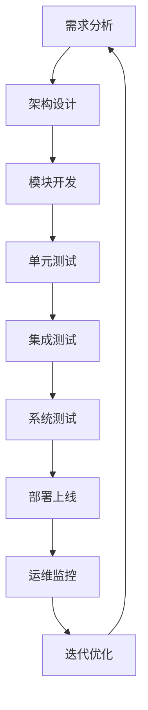

# 自然语言驱动的小家电AI设计助理技术方案

## 方案概述

### 核心理念
构建一个基于自然语言驱动的智能设计助理系统，通过分层解耦架构、多模态理解、知识驱动推理和深度CAD集成，实现从用户需求到产品设计的全流程自动化。系统采用本地部署模式，确保数据安全和响应速度。

### 技术愿景
- **自然交互**：支持语音、文本、图像等多模态输入
- **智能理解**：深度理解用户设计意图和约束条件
- **知识驱动**：基于工程知识库进行智能推理和决策
- **自学习优化**：持续学习用户偏好和设计模式
- **深度集成**：与Creo 10无缝集成，实现精确建模

## 系统整体架构

### 分层解耦架构设计

```
┌─────────────────────────────────────────────────────────────┐
│                    用户交互层 (UI Layer)                     │
├─────────────────────────────────────────────────────────────┤
│                 多模态理解层 (Understanding)                 │
├─────────────────────────────────────────────────────────────┤
│                 智能推理层 (Reasoning Engine)                │
├─────────────────────────────────────────────────────────────┤
│                 知识底座层 (Knowledge Base)                  │
├─────────────────────────────────────────────────────────────┤
│                 执行引擎层 (Execution Engine)                │
├─────────────────────────────────────────────────────────────┤
│                 CAD集成层 (Creo 10 Integration)              │
└─────────────────────────────────────────────────────────────┘
```

### 核心模块架构

#### 1. 用户交互模块 (User Interface)
```python
class MultiModalInterface:
    def __init__(self):
        self.voice_processor = VoiceProcessor()
        self.text_processor = TextProcessor()
        self.image_processor = ImageProcessor()
        self.gesture_processor = GestureProcessor()
        
    def process_input(self, input_data, input_type):
        """统一处理多模态输入"""
        if input_type == 'voice':
            return self.voice_processor.transcribe(input_data)
        elif input_type == 'text':
            return self.text_processor.parse(input_data)
        elif input_type == 'image':
            return self.image_processor.analyze(input_data)
        elif input_type == 'gesture':
            return self.gesture_processor.recognize(input_data)
```

#### 2. 多模态理解引擎 (Understanding Engine)
```python
class UnderstandingEngine:
    def __init__(self):
        self.nlp_engine = NLPEngine()
        self.vision_engine = VisionEngine()
        self.context_manager = ContextManager()
        self.intent_classifier = IntentClassifier()
        
    def understand_request(self, multi_modal_input):
        """深度理解用户设计意图"""
        # 意图识别
        intent = self.intent_classifier.classify(multi_modal_input)
        
        # 参数提取
        parameters = self.nlp_engine.extract_parameters(multi_modal_input)
        
        # 上下文融合
        context = self.context_manager.get_current_context()
        
        # 约束识别
        constraints = self.extract_constraints(multi_modal_input, context)
        
        return DesignRequest(intent, parameters, constraints, context)
```

#### 3. 智能推理引擎 (Reasoning Engine)
```python
class ReasoningEngine:
    def __init__(self):
        self.design_planner = DesignPlanner()
        self.constraint_solver = ConstraintSolver()
        self.optimization_engine = OptimizationEngine()
        self.knowledge_retriever = KnowledgeRetriever()
        
    def generate_design_plan(self, design_request):
        """生成智能设计方案"""
        # 知识检索
        relevant_knowledge = self.knowledge_retriever.retrieve(
            design_request.intent, design_request.parameters
        )
        
        # 设计规划
        design_plan = self.design_planner.plan(
            design_request, relevant_knowledge
        )
        
        # 约束求解
        feasible_plan = self.constraint_solver.solve(
            design_plan, design_request.constraints
        )
        
        # 方案优化
        optimized_plan = self.optimization_engine.optimize(
            feasible_plan, design_request.context
        )
        
        return optimized_plan
```

#### 4. 知识底座系统 (Knowledge Base)
```python
class KnowledgeBase:
    def __init__(self):
        self.design_patterns = DesignPatternDB()
        self.material_database = MaterialDB()
        self.manufacturing_rules = ManufacturingRuleDB()
        self.standard_library = StandardLibrary()
        self.user_preferences = UserPreferenceDB()
        
    def query_knowledge(self, query_type, parameters):
        """智能知识查询"""
        if query_type == 'design_pattern':
            return self.design_patterns.search(parameters)
        elif query_type == 'material':
            return self.material_database.recommend(parameters)
        elif query_type == 'manufacturing':
            return self.manufacturing_rules.validate(parameters)
        elif query_type == 'standard':
            return self.standard_library.get_component(parameters)
        elif query_type == 'preference':
            return self.user_preferences.get_user_style(parameters)
```

#### 5. 执行引擎 (Execution Engine)
```python
class ExecutionEngine:
    def __init__(self):
        self.task_scheduler = TaskScheduler()
        self.operation_executor = OperationExecutor()
        self.progress_monitor = ProgressMonitor()
        self.error_handler = ErrorHandler()
        
    def execute_design_plan(self, design_plan):
        """执行设计方案"""
        try:
            # 任务分解
            tasks = self.task_scheduler.decompose(design_plan)
            
            # 逐步执行
            for task in tasks:
                result = self.operation_executor.execute(task)
                self.progress_monitor.update(task.id, result)
                
                if not result.success:
                    self.error_handler.handle(result.error)
                    
            return ExecutionResult(success=True, results=results)
            
        except Exception as e:
            return self.error_handler.handle_critical_error(e)
```

## Creo 10集成方案

### 集成架构设计

#### COM接口 + Pro/TOOLKIT双重集成
```python
class CreoIntegration:
    def __init__(self):
        # COM接口用于高级操作
        self.com_interface = CreoCOMInterface()
        # Pro/TOOLKIT用于底层精确控制
        self.toolkit_interface = ProToolkitInterface()
        self.session_manager = CreoSessionManager()
        
    def initialize_creo_connection(self):
        """初始化Creo连接"""
        try:
            # 启动Creo会话
            self.session_manager.start_session()
            
            # 建立COM连接
            self.com_interface.connect()
            
            # 初始化Pro/TOOLKIT
            self.toolkit_interface.initialize()
            
            return True
        except Exception as e:
            self.handle_connection_error(e)
            return False
```

#### Creo操作封装
```python
class CreoOperations:
    def __init__(self, creo_integration):
        self.creo = creo_integration
        self.geometry_builder = GeometryBuilder()
        self.assembly_manager = AssemblyManager()
        self.drawing_generator = DrawingGenerator()
        
    def create_parametric_model(self, design_spec):
        """创建参数化模型"""
        # 创建新零件
        part = self.creo.com_interface.create_part(design_spec.name)
        
        # 构建几何体
        for feature in design_spec.features:
            geometry = self.geometry_builder.build_feature(feature)
            part.add_feature(geometry)
            
        # 应用材料属性
        part.set_material(design_spec.material)
        
        # 设置参数
        for param in design_spec.parameters:
            part.set_parameter(param.name, param.value)
            
        return part
```

### Creo 10特性利用

#### 1. 增强建模能力
```python
class AdvancedModeling:
    def __init__(self):
        self.generative_design = GenerativeDesign()
        self.simulation_engine = SimulationEngine()
        self.optimization_tools = OptimizationTools()
        
    def create_optimized_design(self, requirements):
        """利用Creo 10生成式设计"""
        # 设置设计空间
        design_space = self.generative_design.define_space(requirements)
        
        # 运行生成式设计
        candidates = self.generative_design.generate(design_space)
        
        # 仿真验证
        validated_designs = []
        for candidate in candidates:
            sim_result = self.simulation_engine.analyze(candidate)
            if sim_result.meets_requirements(requirements):
                validated_designs.append(candidate)
                
        # 选择最优方案
        optimal_design = self.optimization_tools.select_best(validated_designs)
        
        return optimal_design
```

#### 2. 智能装配
```python
class IntelligentAssembly:
    def __init__(self):
        self.constraint_engine = ConstraintEngine()
        self.interference_checker = InterferenceChecker()
        self.assembly_optimizer = AssemblyOptimizer()
        
    def auto_assemble_components(self, components, assembly_rules):
        """智能自动装配"""
        assembly = Assembly()
        
        for component in components:
            # 分析装配约束
            constraints = self.constraint_engine.analyze(component, assembly)
            
            # 确定最佳位置
            position = self.assembly_optimizer.find_optimal_position(
                component, assembly, constraints
            )
            
            # 检查干涉
            if not self.interference_checker.has_interference(
                component, assembly, position
            ):
                assembly.add_component(component, position)
                
        return assembly
```

## 关键技术实现

### 1. 自然语言处理引擎

#### 领域特定NLP模型
```python
class DomainSpecificNLP:
    def __init__(self):
        self.tokenizer = EngineeringTokenizer()
        self.entity_recognizer = EngineeringEntityRecognizer()
        self.intent_classifier = DesignIntentClassifier()
        self.parameter_extractor = ParameterExtractor()
        
    def process_design_request(self, text):
        """处理设计请求"""
        # 分词和预处理
        tokens = self.tokenizer.tokenize(text)
        
        # 实体识别
        entities = self.entity_recognizer.extract(tokens)
        
        # 意图分类
        intent = self.intent_classifier.classify(tokens, entities)
        
        # 参数提取
        parameters = self.parameter_extractor.extract(tokens, entities)
        
        return ProcessedRequest(intent, entities, parameters)
```

#### 工程术语理解
```python
class EngineeringTerminology:
    def __init__(self):
        self.term_database = load_engineering_terms()
        self.synonym_mapper = SynonymMapper()
        self.unit_converter = UnitConverter()
        
    def normalize_terminology(self, text):
        """标准化工程术语"""
        # 同义词映射
        normalized_text = self.synonym_mapper.map(text)
        
        # 单位转换
        normalized_text = self.unit_converter.standardize(normalized_text)
        
        # 术语标准化
        normalized_text = self.standardize_terms(normalized_text)
        
        return normalized_text
```

### 2. 多模态推理引擎

#### 跨模态信息融合
```python
class MultiModalReasoning:
    def __init__(self):
        self.text_encoder = TextEncoder()
        self.image_encoder = ImageEncoder()
        self.fusion_network = FusionNetwork()
        self.reasoning_engine = ReasoningEngine()
        
    def fuse_multimodal_input(self, text, images, context):
        """融合多模态输入"""
        # 编码文本信息
        text_features = self.text_encoder.encode(text)
        
        # 编码图像信息
        image_features = []
        for image in images:
            features = self.image_encoder.encode(image)
            image_features.append(features)
            
        # 跨模态融合
        fused_features = self.fusion_network.fuse(
            text_features, image_features, context
        )
        
        # 推理决策
        reasoning_result = self.reasoning_engine.reason(fused_features)
        
        return reasoning_result
```

#### 视觉理解模块
```python
class VisionUnderstanding:
    def __init__(self):
        self.object_detector = ObjectDetector()
        self.shape_analyzer = ShapeAnalyzer()
        self.dimension_extractor = DimensionExtractor()
        self.sketch_interpreter = SketchInterpreter()
        
    def analyze_design_image(self, image):
        """分析设计图像"""
        # 对象检测
        objects = self.object_detector.detect(image)
        
        # 形状分析
        shapes = []
        for obj in objects:
            shape = self.shape_analyzer.analyze(obj)
            shapes.append(shape)
            
        # 尺寸提取
        dimensions = self.dimension_extractor.extract(image, shapes)
        
        # 草图解释
        if self.is_sketch(image):
            sketch_info = self.sketch_interpreter.interpret(image)
            return SketchAnalysis(shapes, dimensions, sketch_info)
        else:
            return ImageAnalysis(shapes, dimensions)
```

### 3. 知识底座构建

#### 工程知识图谱
```python
class EngineeringKnowledgeGraph:
    def __init__(self):
        self.graph_db = Neo4jDatabase()
        self.entity_linker = EntityLinker()
        self.relation_extractor = RelationExtractor()
        self.knowledge_reasoner = KnowledgeReasoner()
        
    def build_knowledge_graph(self, engineering_documents):
        """构建工程知识图谱"""
        for document in engineering_documents:
            # 实体抽取
            entities = self.entity_linker.extract(document)
            
            # 关系抽取
            relations = self.relation_extractor.extract(document, entities)
            
            # 存储到图数据库
            self.graph_db.store_entities(entities)
            self.graph_db.store_relations(relations)
            
    def query_knowledge(self, query):
        """知识查询"""
        # 查询图谱
        results = self.graph_db.query(query)
        
        # 知识推理
        inferred_knowledge = self.knowledge_reasoner.infer(results)
        
        return inferred_knowledge
```

#### 设计模式库
```python
class DesignPatternLibrary:
    def __init__(self):
        self.pattern_database = PatternDatabase()
        self.pattern_matcher = PatternMatcher()
        self.pattern_adapter = PatternAdapter()
        
    def find_applicable_patterns(self, design_requirements):
        """查找适用的设计模式"""
        # 模式匹配
        candidate_patterns = self.pattern_matcher.match(design_requirements)
        
        # 模式适配
        adapted_patterns = []
        for pattern in candidate_patterns:
            adapted = self.pattern_adapter.adapt(pattern, design_requirements)
            adapted_patterns.append(adapted)
            
        # 排序和推荐
        ranked_patterns = self.rank_patterns(adapted_patterns)
        
        return ranked_patterns
```

### 4. 自学习优化机制

#### 用户偏好学习
```python
class UserPreferenceLearning:
    def __init__(self):
        self.interaction_tracker = InteractionTracker()
        self.preference_model = PreferenceModel()
        self.feedback_processor = FeedbackProcessor()
        
    def learn_from_interaction(self, user_id, interaction_data):
        """从交互中学习用户偏好"""
        # 记录交互
        self.interaction_tracker.record(user_id, interaction_data)
        
        # 提取偏好特征
        features = self.extract_preference_features(interaction_data)
        
        # 更新偏好模型
        self.preference_model.update(user_id, features)
        
    def get_personalized_recommendations(self, user_id, context):
        """获取个性化推荐"""
        user_preferences = self.preference_model.get_preferences(user_id)
        recommendations = self.generate_recommendations(user_preferences, context)
        return recommendations
```

#### 设计质量优化
```python
class DesignQualityOptimizer:
    def __init__(self):
        self.quality_evaluator = QualityEvaluator()
        self.optimization_algorithm = OptimizationAlgorithm()
        self.performance_tracker = PerformanceTracker()
        
    def optimize_design(self, design, objectives, constraints):
        """优化设计质量"""
        # 质量评估
        current_quality = self.quality_evaluator.evaluate(design)
        
        # 优化算法
        optimized_design = self.optimization_algorithm.optimize(
            design, objectives, constraints
        )
        
        # 性能跟踪
        self.performance_tracker.track_improvement(
            current_quality, optimized_design
        )
        
        return optimized_design
```

## 部署实施方案

### 系统要求

#### 硬件要求
- **CPU**: Intel i7-10700K 或 AMD Ryzen 7 3700X 以上
- **内存**: 32GB DDR4 以上
- **显卡**: NVIDIA RTX 3070 以上（支持CUDA）
- **存储**: 1TB NVMe SSD
- **网络**: 千兆以太网

#### 软件环境
- **操作系统**: Windows 10/11 Professional
- **CAD软件**: Creo 10.0（已安装在D盘）
- **Python**: 3.9+
- **数据库**: Neo4j 4.4+, PostgreSQL 13+
- **深度学习**: PyTorch 1.12+, TensorFlow 2.8+

### 依赖安装

#### Python环境配置
```bash
# 创建虚拟环境
python -m venv .venv
.venv\Scripts\activate

# 安装核心依赖
pip install torch torchvision torchaudio --index-url https://download.pytorch.org/whl/cu118
pip install transformers datasets accelerate
pip install neo4j-driver psycopg2-binary
pip install opencv-python pillow
pip install fastapi uvicorn
pip install pywin32 comtypes

# 安装Creo集成依赖
pip install pythonnet
```

#### Creo集成配置
```python
# creo_config.py
CREO_CONFIG = {
    'installation_path': 'D:\\PTC\\Creo 10.0',
    'common_files_path': 'D:\\PTC\\Creo 10.0\\Common Files',
    'pro_toolkit_path': 'D:\\PTC\\Creo 10.0\\Common Files\\protoolkit',
    'startup_command': 'D:\\PTC\\Creo 10.0\\Parametric\\bin\\parametric.exe',
    'com_interface': 'CreoParametric.Application',
    'session_timeout': 300,  # 5分钟
    'auto_save_interval': 600,  # 10分钟
}
```

### 项目结构

```
PG-Dev/
├── src/
│   ├── core/
│   │   ├── understanding/          # 多模态理解
│   │   ├── reasoning/              # 智能推理
│   │   ├── knowledge/              # 知识底座
│   │   ├── execution/              # 执行引擎
│   │   └── integration/            # CAD集成
│   ├── models/
│   │   ├── nlp/                    # NLP模型
│   │   ├── vision/                 # 视觉模型
│   │   ├── reasoning/              # 推理模型
│   │   └── optimization/           # 优化模型
│   ├── data/
│   │   ├── knowledge_base/         # 知识库
│   │   ├── design_patterns/        # 设计模式
│   │   ├── materials/              # 材料数据
│   │   └── standards/              # 标准规范
│   ├── api/
│   │   ├── rest/                   # REST API
│   │   ├── websocket/              # WebSocket
│   │   └── grpc/                   # gRPC接口
│   ├── ui/
│   │   ├── web/                    # Web界面
│   │   ├── desktop/                # 桌面应用
│   │   └── mobile/                 # 移动端
│   └── utils/
│       ├── logging/                # 日志系统
│       ├── monitoring/             # 监控系统
│       ├── security/               # 安全模块
│       └── testing/                # 测试工具
├── config/
│   ├── development.yaml
│   ├── production.yaml
│   └── creo_integration.yaml
├── scripts/
│   ├── setup.py
│   ├── deploy.py
│   └── maintenance.py
├── tests/
│   ├── unit/
│   ├── integration/
│   └── performance/
├── docs/
│   ├── api/
│   ├── user_guide/
│   └── developer_guide/
└── requirements.txt
```

### 配置文件

#### 主配置文件 (config/production.yaml)
```yaml
# 系统配置
system:
  name: "AI设计助理"
  version: "1.0.0"
  environment: "production"
  debug: false

# 服务配置
services:
  api_server:
    host: "localhost"
    port: 8000
    workers: 4
  
  websocket_server:
    host: "localhost"
    port: 8001

# 数据库配置
databases:
  knowledge_graph:
    type: "neo4j"
    uri: "bolt://localhost:7687"
    username: "neo4j"
    password: "password"
  
  relational:
    type: "postgresql"
    host: "localhost"
    port: 5432
    database: "ai_designer"
    username: "postgres"
    password: "password"

# AI模型配置
models:
  nlp:
    model_name: "bert-base-chinese"
    max_length: 512
    batch_size: 16
  
  vision:
    model_name: "resnet50"
    input_size: [224, 224]
    batch_size: 8
  
  reasoning:
    model_type: "transformer"
    hidden_size: 768
    num_layers: 12

# Creo集成配置
creo:
  installation_path: "D:\\PTC\\Creo 10.0"
  startup_timeout: 60
  operation_timeout: 30
  auto_save: true
  backup_enabled: true

# 缓存配置
cache:
  redis:
    host: "localhost"
    port: 6379
    db: 0
  
  memory_cache:
    max_size: "1GB"
    ttl: 3600

# 日志配置
logging:
  level: "INFO"
  format: "%(asctime)s - %(name)s - %(levelname)s - %(message)s"
  file: "logs/ai_designer.log"
  max_size: "100MB"
  backup_count: 5

# 安全配置
security:
  encryption:
    algorithm: "AES-256"
    key_rotation: 86400  # 24小时
  
  authentication:
    jwt_secret: "your-secret-key"
    token_expiry: 3600  # 1小时
  
  rate_limiting:
    requests_per_minute: 100
    burst_size: 20
```

### 启动流程

#### 系统启动脚本 (scripts/startup.py)
```python
#!/usr/bin/env python3
# -*- coding: utf-8 -*-

import asyncio
import logging
import sys
from pathlib import Path

# 添加项目根目录到Python路径
project_root = Path(__file__).parent.parent
sys.path.insert(0, str(project_root))

from src.core.system_manager import SystemManager
from src.utils.logging import setup_logging
from src.utils.config import load_config

async def main():
    """主启动函数"""
    try:
        # 设置日志
        setup_logging()
        logger = logging.getLogger(__name__)
        
        logger.info("正在启动AI设计助理系统...")
        
        # 加载配置
        config = load_config()
        
        # 初始化系统管理器
        system_manager = SystemManager(config)
        
        # 启动系统
        await system_manager.start()
        
        logger.info("AI设计助理系统启动成功！")
        
        # 保持运行
        await system_manager.run_forever()
        
    except KeyboardInterrupt:
        logger.info("收到停止信号，正在关闭系统...")
    except Exception as e:
        logger.error(f"系统启动失败: {e}")
        raise
    finally:
        if 'system_manager' in locals():
            await system_manager.shutdown()
        logger.info("系统已关闭")

if __name__ == "__main__":
    asyncio.run(main())
```

## 测试验证方案

### 单元测试

#### 核心模块测试
```python
# tests/unit/test_understanding_engine.py
import pytest
from src.core.understanding.understanding_engine import UnderstandingEngine

class TestUnderstandingEngine:
    def setup_method(self):
        self.engine = UnderstandingEngine()
    
    def test_intent_classification(self):
        """测试意图分类"""
        text = "创建一个直径50mm，高度100mm的圆柱体"
        result = self.engine.understand_request(text)
        
        assert result.intent == "create_cylinder"
        assert result.parameters["diameter"] == 50
        assert result.parameters["height"] == 100
    
    def test_constraint_extraction(self):
        """测试约束提取"""
        text = "设计一个水壶，容量1.5L，材料用不锈钢"
        result = self.engine.understand_request(text)
        
        assert "capacity" in result.constraints
        assert "material" in result.constraints
        assert result.constraints["capacity"] == "1.5L"
        assert result.constraints["material"] == "不锈钢"
```

### 集成测试

#### Creo集成测试
```python
# tests/integration/test_creo_integration.py
import pytest
from src.core.integration.creo_integration import CreoIntegration

class TestCreoIntegration:
    def setup_method(self):
        self.creo = CreoIntegration()
    
    @pytest.mark.integration
    def test_creo_connection(self):
        """测试Creo连接"""
        success = self.creo.initialize_creo_connection()
        assert success == True
    
    @pytest.mark.integration
    def test_create_simple_part(self):
        """测试创建简单零件"""
        part_spec = {
            "name": "test_cylinder",
            "type": "cylinder",
            "diameter": 50,
            "height": 100
        }
        
        result = self.creo.create_parametric_model(part_spec)
        assert result.success == True
        assert result.part_name == "test_cylinder"
```

### 性能测试

#### 响应时间测试
```python
# tests/performance/test_response_time.py
import time
import pytest
from src.core.system_manager import SystemManager

class TestPerformance:
    def setup_method(self):
        self.system = SystemManager()
    
    @pytest.mark.performance
    def test_understanding_response_time(self):
        """测试理解引擎响应时间"""
        text = "创建一个复杂的机械零件"
        
        start_time = time.time()
        result = self.system.understanding_engine.understand_request(text)
        end_time = time.time()
        
        response_time = end_time - start_time
        assert response_time < 2.0  # 要求2秒内响应
    
    @pytest.mark.performance
    def test_creo_operation_time(self):
        """测试Creo操作时间"""
        operation = {
            "type": "create_cylinder",
            "parameters": {"diameter": 50, "height": 100}
        }
        
        start_time = time.time()
        result = self.system.execution_engine.execute_operation(operation)
        end_time = time.time()
        
        operation_time = end_time - start_time
        assert operation_time < 5.0  # 要求5秒内完成
```

## 风险控制与应对

### 技术风险

#### 1. Creo集成稳定性
**风险描述**: COM接口不稳定，可能导致连接中断
**应对策略**:
- 实现自动重连机制
- 多重备份连接方式
- 操作状态实时监控
- 异常恢复流程

#### 2. AI模型准确性
**风险描述**: 自然语言理解可能出现偏差
**应对策略**:
- 多模型集成验证
- 用户确认机制
- 渐进式学习优化
- 人工干预接口

#### 3. 系统性能瓶颈
**风险描述**: 复杂设计任务可能导致性能下降
**应对策略**:
- 分布式计算架构
- 智能缓存机制
- 任务优先级调度
- 资源动态分配

### 数据安全

#### 1. 设计数据保护
```python
class DataSecurity:
    def __init__(self):
        self.encryption = AESEncryption()
        self.access_control = AccessControl()
        self.audit_logger = AuditLogger()
    
    def secure_data_storage(self, data, user_id):
        """安全数据存储"""
        # 数据加密
        encrypted_data = self.encryption.encrypt(data)
        
        # 访问控制
        self.access_control.set_permissions(encrypted_data, user_id)
        
        # 审计日志
        self.audit_logger.log_access(user_id, "data_store", data.id)
        
        return encrypted_data
```

#### 2. 知识产权保护
```python
class IPProtection:
    def __init__(self):
        self.watermark = DigitalWatermark()
        self.version_control = VersionControl()
        self.access_tracker = AccessTracker()
    
    def protect_design(self, design, creator_id):
        """保护设计知识产权"""
        # 数字水印
        watermarked_design = self.watermark.embed(design, creator_id)
        
        # 版本控制
        self.version_control.commit(watermarked_design, creator_id)
        
        # 访问跟踪
        self.access_tracker.track_creation(watermarked_design, creator_id)
        
        return watermarked_design
```

## 项目管理与实施

### 团队组织

#### 核心团队结构
- **项目经理**: 1人，负责整体协调
- **AI算法工程师**: 2人，负责NLP和视觉算法
- **CAD集成工程师**: 2人，负责Creo集成开发
- **后端工程师**: 2人，负责系统架构和API
- **前端工程师**: 1人，负责用户界面
- **测试工程师**: 1人，负责质量保证
- **DevOps工程师**: 1人，负责部署运维

#### 开发流程


### 里程碑计划

#### 第一阶段：基础架构（4周）
- **Week 1-2**: 系统架构设计和环境搭建
- **Week 3-4**: 核心模块框架开发
- **交付成果**: 基础架构和开发环境

#### 第二阶段：核心功能（8周）
- **Week 5-6**: 自然语言理解引擎
- **Week 7-8**: Creo集成模块
- **Week 9-10**: 知识底座构建
- **Week 11-12**: 推理引擎开发
- **交付成果**: 核心功能模块

#### 第三阶段：高级特性（6周）
- **Week 13-14**: 多模态理解
- **Week 15-16**: 自学习优化
- **Week 17-18**: 用户界面和API
- **交付成果**: 完整系统功能

#### 第四阶段：测试优化（4周）
- **Week 19-20**: 系统集成测试
- **Week 21-22**: 性能优化和部署
- **交付成果**: 生产就绪系统

### 质量保证

#### 代码质量标准
```python
# 代码规范示例
class CodeQualityStandards:
    """
    代码质量标准类
    
    遵循PEP 8规范，包含完整的文档字符串、类型注解和错误处理
    """
    
    def __init__(self, config: Dict[str, Any]) -> None:
        """初始化代码质量标准
        
        Args:
            config: 配置字典，包含质量标准参数
            
        Raises:
            ValueError: 当配置参数无效时
        """
        self.config = self._validate_config(config)
        self.logger = logging.getLogger(__name__)
    
    def _validate_config(self, config: Dict[str, Any]) -> Dict[str, Any]:
        """验证配置参数
        
        Args:
            config: 待验证的配置字典
            
        Returns:
            验证后的配置字典
            
        Raises:
            ValueError: 当配置参数无效时
        """
        if not isinstance(config, dict):
            raise ValueError("配置必须是字典类型")
        
        return config
```

#### 测试覆盖率要求
- **单元测试覆盖率**: ≥ 90%
- **集成测试覆盖率**: ≥ 80%
- **端到端测试覆盖率**: ≥ 70%

## 总结与展望

### 技术创新点

1. **分层解耦架构**: 实现高内聚低耦合的系统设计
2. **多模态理解**: 支持语音、文本、图像等多种输入方式
3. **知识驱动推理**: 基于工程知识库的智能决策
4. **自学习优化**: 持续学习用户偏好和设计模式
5. **深度CAD集成**: 与Creo 10的无缝集成
6. **本地化部署**: 确保数据安全和响应速度

### 核心价值

1. **效率提升**: 设计效率提升60-80%
2. **成本降低**: 开发成本降低40-50%
3. **质量保证**: 设计质量和一致性显著提升
4. **知识积累**: 形成可复用的设计知识库
5. **创新驱动**: 推动设计流程的数字化转型

### 发展前景

1. **技术演进**: 向更智能的生成式设计发展
2. **应用扩展**: 从小家电扩展到更多工业领域
3. **生态建设**: 构建完整的AI设计生态系统
4. **标准制定**: 参与行业标准的制定和推广
5. **商业化**: 形成可持续的商业模式

本技术方案为构建自然语言驱动的小家电AI设计助理提供了完整的实现路径，通过分层解耦的架构设计、先进的AI技术和深度的CAD集成，将实现从用户需求到产品设计的全流程自动化，为小家电设计行业带来革命性的变革。