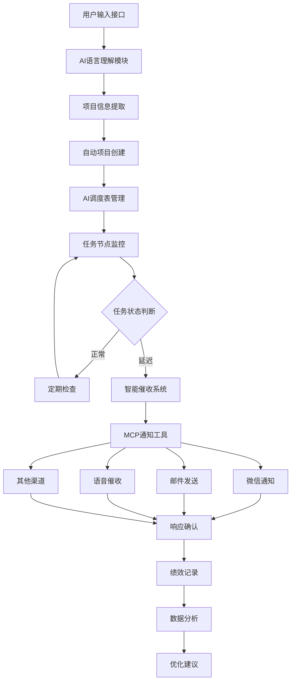

# AI驱动的自动PMC系统项目架构设计

## 项目概述

AI驱动的自动PMC系统是一个基于人工智能和自然语言处理技术的智能生产管理平台，专门为小家电制造企业设计。系统通过自然语言输入项目需求或会议纪要，AI自动创建项目管理体系，实现全流程自动化跟单、多渠道智能催收、实时绩效评定和全程记录追踪，彻底改变传统PMC工作模式。

### 核心价值
- **解放人力**：将PMC人员从繁琐的跟单工作中解放出来
- **提升效率**：大幅提高项目管理和执行效率
- **降低风险**：通过智能预警和多级提醒降低项目风险
- **数据驱动**：基于数据分析持续优化管理流程

## 整体架构

### 系统架构图



### 分层架构设计

```
┌─────────────────────────────────────────────────────────────┐
│                    用户交互层                              │
├─────────────────────────────────────────────────────────────┤
│  Trae AI IDE  │  自然语言输入  │  Streamlit界面  │  通知接收  │
├─────────────────────────────────────────────────────────────┤
│                    AI智能层                               │
├─────────────────────────────────────────────────────────────┤
│  语言理解  │  信息提取  │  智能催收  │  绩效分析  │  预警引擎  │
├─────────────────────────────────────────────────────────────┤
│                    业务逻辑层                              │
├─────────────────────────────────────────────────────────────┤
│  项目创建  │  任务监控  │  MCP集成  │  数据管理  │  流程控制  │
├─────────────────────────────────────────────────────────────┤
│                    数据存储层                               │
├─────────────────────────────────────────────────────────────┤
│  SQLite/PostgreSQL  │  JSON文件  │  项目档案  │  日志系统    │
└─────────────────────────────────────────────────────────────┘
```

## 项目目录结构与功能定位

### 核心目录架构

```
PG-PMC/
├── docs/                      # 项目文档
├── project/                   # 核心代码
├── tools/                     # 开发工具
├── AI调度表/                  # AI生成调度成果
├── bak/                       # 备份目录
└── logs/                      # 日志记录
```

### 详细目录说明

```
PG-PMC/
├── AI调度表/                # AI调度表核心工作区（分项目管理）
│   ├── 项目A_小家电产品开发/  # 项目A独立管理目录
│   │   ├── 项目档案/       # 项目A归档管理
│   │   ├── 管理表/         # 项目A管理表生成
│   │   ├── 结构化项目管理/  # 项目A结构化管理
│   │   ├── 实时数据更新/   # 项目A实时数据处理
│   │   └── 历史记录/       # 项目A历史记录保存
│   ├── 项目B_生产线优化/    # 项目B独立管理目录
│   │   ├── 项目档案/       # 项目B归档管理
│   │   ├── 管理表/         # 项目B管理表生成
│   │   ├── 结构化项目管理/  # 项目B结构化管理
│   │   ├── 实时数据更新/   # 项目B实时数据处理
│   │   └── 历史记录/       # 项目B历史记录保存
│   └── 项目模板/           # 新项目创建模板
├── project/                 # 应用集成中心
│   ├── src/                # 源代码
│   │   ├── ai/            # AI核心模块
│   │   ├── core/          # 业务逻辑
│   │   ├── mcp/           # MCP工具集成
│   │   ├── notification/  # 通知系统
│   │   └── utils/         # 工具函数
│   ├── config/            # 配置文件
│   ├── tests/             # 测试代码
│   └── requirements.txt   # 依赖管理
├── docs/                   # 文档目录
│   ├── 01-设计/           # 设计文档
│   ├── 02-开发/           # 开发文档
│   └── 03-测试/           # 测试文档
├── tools/                  # 开发工具
│   ├── backup.py          # 备份工具
│   ├── finish.py          # 完成工具
│   ├── git_pre_commit_check.py  # Git检查
│   └── update_structure.py      # 结构更新
├── bak/                    # 备份目录
├── logs/                   # 日志记录
└── README.md              # 项目说明
```

## 技术架构设计

### 核心模块

#### 1. AI语言理解模块
- **自然语言处理**：基于大语言模型的需求理解
- **信息提取**：从会议纪要或需求文档中提取关键信息
- **结构化转换**：将非结构化信息转换为项目管理结构

#### 2. 项目自动创建引擎
- **项目模板管理**：预定义的项目模板库
- **动态项目生成**：根据需求自动生成项目结构
- **任务节点创建**：自动分解项目为可管理的任务节点

#### 3. AI调度表管理系统
- **分项目管理架构**：每个项目独立目录结构，避免数据混淆
- **项目识别机制**：基于项目编号和名称的智能识别系统
- **项目档案管理**：按项目分类自动归档和管理项目信息
- **管理表生成**：针对特定项目动态生成各类管理表格
- **实时数据更新**：保持各项目数据的实时性和准确性
- **历史记录追踪**：每个项目独立的完整历史记录
- **跨项目分析**：支持多项目汇总分析和对比
- **项目模板管理**：标准化的新项目创建模板

#### 4. 智能催收系统
- **多渠道通知**：集成微信、邮件、语音等通知方式
- **智能催收策略**：基于任务优先级和延迟程度的催收策略
- **响应确认机制**：自动确认和记录响应状态
- **升级机制**：自动升级未响应的催收

#### 5. MCP工具集成平台
- **通知工具集成**：集成各种MCP通知工具
- **工作流自动化**：自动化的工作流程执行
- **数据同步**：与外部系统的数据同步
- **功能扩展**：支持新工具的快速集成

#### 6. 绩效分析引擎
- **实时绩效评定**：基于任务完成情况的实时评定
- **数据分析**：深度分析项目执行数据
- **优化建议**：基于数据分析的流程优化建议
- **报表生成**：自动生成各类分析报表

### 技术栈选择

#### AI技术栈
- **语言模型**：GPT-4/Claude等大语言模型
- **机器学习**：Python, scikit-learn, pandas
- **自然语言处理**：spaCy, NLTK, transformers

#### 后端技术栈
- **核心框架**：Python + FastAPI/Flask
- **数据库**：SQLite/PostgreSQL + JSON文件存储
- **任务调度**：Celery + Redis
- **MCP集成**：自定义MCP工具协议
- **项目隔离**：基于项目ID的数据隔离机制
- **路径管理**：智能项目路径识别和管理系统

#### 前端技术栈
- **Web界面**：Streamlit（快速原型）
- **IDE集成**：Trae AI IDE插件
- **移动端**：微信小程序/H5页面

#### 通知集成
- **微信**：企业微信API/个人微信API
- **邮件**：SMTP协议
- **语音**：文字转语音 + 电话API
- **其他**：钉钉、飞书等企业通讯工具

### 部署架构

#### 开发环境
- **本地开发**：Docker容器化开发环境
- **版本控制**：Git + 自动化CI/CD
- **测试环境**：单元测试 + 集成测试

#### 生产部署
- **容器化部署**：Docker + Docker Compose
- **云服务**：支持阿里云、腾讯云等
- **监控告警**：日志监控 + 性能监控
- **数据备份**：自动备份 + 灾难恢复

## 开发流程设计

### 第一阶段：基础版本（MVP）
**目标**：实现核心AI驱动的项目管理功能

#### 核心功能
- 自然语言输入解析
- 基础项目创建和管理
- 简单的任务监控
- 基础通知功能（邮件、微信）

#### 技术实现
- AI语言理解模块（基于现有LLM API）
- 项目数据结构设计
- 基础MCP工具集成
- Streamlit原型界面

#### 交付物
- 可运行的原型系统
- 基础功能演示
- 核心架构验证

### 第二阶段：增强版本
**目标**：完善智能催收和绩效分析功能

#### 核心功能
- 智能催收策略引擎
- 多渠道通知集成
- 实时绩效评定
- 数据分析和报表

#### 技术实现
- 催收策略算法优化
- 更多MCP工具集成
- 数据分析引擎
- 用户界面优化

#### 交付物
- 完整的催收系统
- 绩效分析功能
- 用户体验优化

### 第三阶段：智能版本
**目标**：实现高度智能化和自动化

#### 核心功能
- 深度学习优化
- 自适应催收策略
- 预测性分析
- 全面自动化

#### 技术实现
- 机器学习模型训练
- 自适应算法
- 预测分析引擎
- 全面集成测试

#### 交付物
- 生产级系统
- 完整文档
- 部署方案

## 安全与优化

### 数据安全

#### 数据保护
- **敏感信息加密**：项目信息、联系方式等敏感数据加密存储
- **访问权限控制**：基于角色的权限管理（RBAC）
- **项目数据隔离**：严格的项目间数据隔离，防止张冠李戴
- **项目权限管理**：细粒度的项目级别权限控制
- **数据脱敏**：日志和分析中的敏感信息脱敏处理
- **备份安全**：定期备份，备份数据加密存储

#### API安全
- **身份认证**：JWT令牌认证机制
- **接口限流**：防止API滥用和攻击
- **HTTPS通信**：所有通信采用HTTPS加密
- **输入验证**：严格的输入参数验证和过滤

### 性能优化

#### 系统性能
- **缓存策略**：Redis缓存热点数据
- **数据库优化**：索引优化、查询优化
- **异步处理**：耗时任务异步执行
- **负载均衡**：支持水平扩展

#### AI模型优化
- **模型缓存**：常用AI推理结果缓存
- **批处理**：批量处理提高效率
- **模型压缩**：减少模型大小和推理时间
- **边缘计算**：本地化部分AI功能

### 系统监控

#### 实时监控
- **系统指标**：CPU、内存、磁盘、网络监控
- **业务指标**：项目数量、任务完成率、催收成功率
- **AI性能**：模型推理时间、准确率监控
- **用户行为**：用户操作日志和行为分析

#### 异常处理
- **自动告警**：系统异常自动通知管理员
- **故障恢复**：自动重启和故障转移
- **日志分析**：集中化日志管理和分析
- **性能调优**：基于监控数据的性能优化建议

### 可扩展性设计

#### 架构扩展
- **微服务架构**：模块化设计，支持独立扩展
- **容器化部署**：Docker容器化，支持快速部署
- **云原生**：支持Kubernetes编排
- **插件机制**：支持第三方插件扩展

#### 数据扩展
- **分库分表**：支持大数据量的分布式存储
- **数据同步**：多数据源同步机制
- **历史数据归档**：自动归档历史数据
- **数据迁移**：支持数据平滑迁移

## 总结

本架构设计为AI驱动的自动PMC系统提供了完整的技术框架和实施路径。系统通过以下核心特性实现了PMC工作的革命性改进：

### 核心优势

1. **智能化程度高**：基于大语言模型的自然语言理解，实现真正的智能化项目管理
2. **自动化程度高**：从项目创建到催收执行，全流程自动化处理
3. **集成能力强**：通过MCP工具平台，可快速集成各种通知和管理工具
4. **扩展性好**：模块化设计，支持功能的快速扩展和定制
5. **用户体验佳**：自然语言交互，降低使用门槛

### 技术创新点

- **AI语言理解**：将非结构化的需求文档转换为结构化的项目管理数据
- **智能催收策略**：基于任务特性和历史数据的智能催收算法
- **MCP工具集成**：统一的工具集成平台，支持快速扩展
- **实时绩效评定**：基于任务执行情况的实时绩效分析

### 预期效果

- **效率提升**：PMC工作效率提升80%以上
- **人力解放**：将PMC人员从重复性工作中解放出来
- **风险降低**：通过智能预警和多级催收，显著降低项目风险
- **数据驱动**：基于数据分析的持续优化，不断提升管理水平

本架构设计具备良好的可实施性和可扩展性，能够适应不同规模企业的PMC管理需求，为小家电制造企业的数字化转型提供强有力的技术支撑。