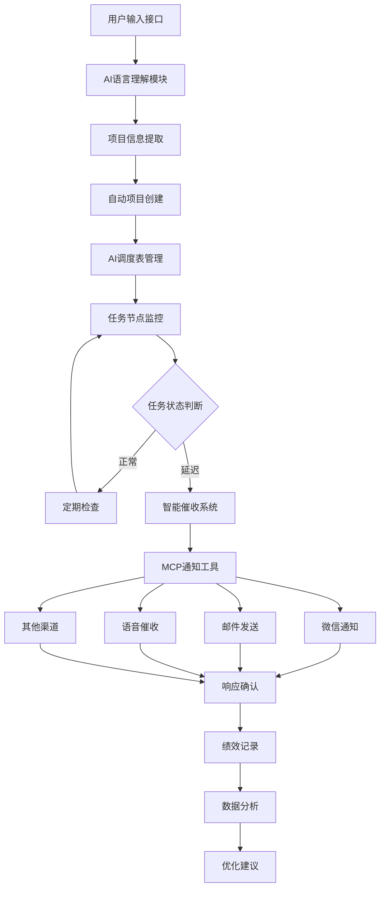

# PMC全流程图表界面应用软件项目架构设计

## 项目概述

PMC全流程图表界面应用软件是一个基于人工智能和自然语言处理技术的智能生产管理平台，专门为小家电制造企业设计。系统基于BD400原始订单表和现有PMC工作流程，开发一套完整的图表界面PMC管理应用软件，实现从订单接收到产品交付的全流程可视化管理，集成微信、手机、邮件的自动跟进与催办功能。

### 项目存储位置
- **开发软件存储**：S:\PG-PMC\project
- **项目数据位置**：S:\PG-PMC\AI调度表

### 技术愿景
- **可视化优先**：以图表界面为核心，提供直观的数据展示和操作体验
- **全流程覆盖**：从订单接收到产品交付的完整业务流程支持
- **智能催办**：集成多渠道自动跟进催办，提升工作效率
- **实时监控**：实时数据更新和状态监控，及时发现和处理异常
- **协同工作**：支持多部门协作的统一工作平台

### 架构原则
- **前端优先**：重点投入前端图表界面开发，提供优秀的用户体验
- **数据驱动**：以订单数据为核心，构建完整的数据流转体系
- **模块化设计**：采用组件化开发，各功能模块独立开发和维护
- **集成友好**：支持与现有系统的集成，降低实施成本
- **响应式设计**：支持PC端和移动端的响应式访问

### 核心价值
- **解放人力**：将PMC人员从繁琐的跟单工作中解放出来
- **提升效率**：大幅提高项目管理和执行效率
- **降低风险**：通过智能预警和多级提醒降低项目风险
- **数据驱动**：基于数据分析持续优化管理流程

## 整体架构

### 双模式架构设计

系统采用双模式架构，支持IDE集成模式和独立Web应用模式：

#### 模式一：IDE集成模式（主要模式）
- **集成环境**：深度集成到Trae AI IDE中
- **工作流程**：在IDE中直接进行PMC管理操作
- **数据同步**：与IDE项目数据实时同步
- **用户体验**：无缝的开发环境集成体验

#### 模式二：独立Web应用模式
- **独立部署**：可独立部署的Web应用
- **浏览器访问**：支持各种浏览器访问
- **移动适配**：响应式设计，支持移动端
- **灵活部署**：支持云端和本地部署

### 系统架构图



### 分层架构设计

```
┌─────────────────────────────────────────────────────────────┐
│                    用户交互层                                │
├─────────────────────────────────────────────────────────────┤
│  Trae AI IDE集成  │  Web图表界面  │  移动端H5  │  微信小程序  │
├─────────────────────────────────────────────────────────────┤
│                   前端展示层                                │
├─────────────────────────────────────────────────────────────┤
│  订单看板  │  生产进度图  │  物料状态图  │  交付时间轴  │  KPI仪表盘 │
├─────────────────────────────────────────────────────────────┤
│                    AI智能层                                 │
├─────────────────────────────────────────────────────────────┤
│  智能调度  │  异常预警  │  催办策略  │  数据分析  │  决策支持  │
├─────────────────────────────────────────────────────────────┤
│                   业务逻辑层                                │
├─────────────────────────────────────────────────────────────┤
│  订单管理  │  生产计划  │  物料管控  │  质量跟踪  │  交付管理  │
├─────────────────────────────────────────────────────────────┤
│                   集成服务层                               │
├─────────────────────────────────────────────────────────────┤
│  微信集成  │  邮件服务  │  短信服务  │  Excel兼容  │  ERP对接  │
├─────────────────────────────────────────────────────────────┤
│                    数据存储层                               │
├─────────────────────────────────────────────────────────────┤
│  订单数据库  │  生产数据  │  物料数据  │  质量数据  │  配置数据  │
└─────────────────────────────────────────────────────────────┘
```

### 分层设计详解

#### 1. 用户交互层
- **Trae AI IDE集成**：主要工作界面，深度集成在IDE环境中
- **Web图表界面**：基于React+Ant Design的现代化图表界面
- **移动端H5**：响应式设计，支持手机和平板访问
- **微信小程序**：轻量级移动端应用，支持微信生态

#### 2. 前端展示层
- **订单看板**：订单状态总览和实时更新
- **生产进度图**：生产计划和实际进度对比
- **物料状态图**：物料库存和需求状态可视化
- **交付时间轴**：交付计划和里程碑跟踪
- **KPI仪表盘**：关键绩效指标实时监控

#### 3. AI智能层
- **智能调度**：基于AI的生产计划优化
- **异常预警**：智能识别和预警潜在问题
- **催办策略**：智能制定催办策略和执行
- **数据分析**：深度数据挖掘和趋势分析
- **决策支持**：基于数据的智能决策建议

#### 4. 业务逻辑层
- **订单管理**：订单全生命周期管理
- **生产计划**：生产计划制定和调整
- **物料管控**：物料需求计划和库存管理
- **质量跟踪**：质量检验和问题跟踪
- **交付管理**：交付计划和物流跟踪

#### 5. 集成服务层
- **微信集成**：企业微信和个人微信集成
- **邮件服务**：SMTP邮件发送服务
- **短信服务**：短信通知和提醒服务
- **Excel兼容**：勤哲Excel服务器兼容性
- **ERP对接**：与现有ERP系统的数据对接

#### 6. 数据存储层
- **订单数据库**：BD400订单表和相关数据
- **生产数据**：生产计划、进度、质量数据
- **物料数据**：物料清单、库存、采购数据
- **质量数据**：检验记录、不良品跟踪数据
- **配置数据**：系统配置、用户权限数据

## 项目目录结构与功能定位

### 核心目录架构

```
PG-PMC/
├── docs/                      # 项目文档
├── project/                   # 核心代码
├── tools/                     # 开发工具
├── AI调度表/                  # AI生成调度成果
├── bak/                       # 备份目录
└── logs/                      # 日志记录
```

### 详细目录说明

```
PG-PMC/
├── AI调度表/                # AI调度表核心工作区（分项目管理）
│   ├── 项目A_小家电产品开发/  # 项目A独立管理目录
│   │   ├── 项目档案/       # 项目A归档管理
│   │   ├── 管理表/         # 项目A管理表生成
│   │   ├── 结构化项目管理/  # 项目A结构化管理
│   │   ├── 实时数据更新/   # 项目A实时数据处理
│   │   └── 历史记录/       # 项目A历史记录保存
│   ├── 项目B_生产线优化/    # 项目B独立管理目录
│   │   ├── 项目档案/       # 项目B归档管理
│   │   ├── 管理表/         # 项目B管理表生成
│   │   ├── 结构化项目管理/  # 项目B结构化管理
│   │   ├── 实时数据更新/   # 项目B实时数据处理
│   │   └── 历史记录/       # 项目B历史记录保存
│   └── 项目模板/           # 新项目创建模板
├── project/                 # 应用集成中心
│   ├── src/                # 源代码
│   │   ├── ai/            # AI核心模块
│   │   ├── core/          # 业务逻辑
│   │   ├── mcp/           # MCP工具集成
│   │   ├── notification/  # 通知系统
│   │   └── utils/         # 工具函数
│   ├── config/            # 配置文件
│   ├── tests/             # 测试代码
│   └── requirements.txt   # 依赖管理
├── docs/                   # 文档目录
│   ├── 01-设计/           # 设计文档
│   ├── 02-开发/           # 开发文档
│   └── 03-测试/           # 测试文档
├── tools/                  # 开发工具
│   ├── backup.py          # 备份工具
│   ├── finish.py          # 完成工具
│   ├── git_pre_commit_check.py  # Git检查
│   └── update_structure.py      # 结构更新
├── bak/                    # 备份目录
├── logs/                   # 日志记录
└── README.md              # 项目说明
```

## 技术架构设计

### 核心模块

#### 1. 订单管理模块
- **订单接收处理**：BD400订单表数据导入和解析
- **订单状态跟踪**：订单全生命周期状态管理
- **订单变更管理**：订单修改、取消、延期处理
- **订单数据验证**：订单信息完整性和准确性验证

#### 2. 生产计划模块
- **生产排程**：基于订单需求和产能的智能排程
- **物料需求计划**：MRP物料需求计划生成
- **产能分析**：生产能力评估和瓶颈识别
- **计划调整**：动态调整生产计划应对变化

#### 3. 进度监控模块
- **实时进度跟踪**：生产进度实时监控和更新
- **里程碑管理**：关键节点和里程碑跟踪
- **异常预警**：进度异常自动识别和预警
- **可视化展示**：进度数据图表化展示

#### 4. 智能催办模块
- **催办策略引擎**：基于业务规则的智能催办策略
- **多渠道通知**：微信、邮件、短信等多渠道催办
- **催办升级机制**：逐级升级的催办流程
- **催办效果跟踪**：催办结果统计和分析

#### 5. 数据分析模块
- **KPI指标计算**：关键绩效指标实时计算
- **趋势分析**：生产数据趋势分析和预测
- **异常检测**：数据异常自动检测和报警
- **报表生成**：各类管理报表自动生成

#### 6. 系统集成模块
- **Excel兼容性**：勤哲Excel服务器数据兼容
- **ERP系统对接**：与现有ERP系统数据同步
- **第三方API集成**：外部系统API集成
- **数据导入导出**：多格式数据导入导出支持

### 技术栈选择

#### 前端技术栈（重点投入）
- **核心框架**：React 18 + TypeScript
- **UI组件库**：Ant Design 5.x（企业级UI组件）
- **图表库**：ECharts + G2Plot（数据可视化）
- **状态管理**：Redux Toolkit + RTK Query
- **路由管理**：React Router 6
- **构建工具**：Vite（快速构建）
- **样式方案**：CSS Modules + Less
- **移动端适配**：响应式设计 + PWA

#### 后端技术栈
- **核心框架**：Python 3.11 + FastAPI
- **数据库**：PostgreSQL 15（主数据库）+ Redis（缓存）
- **ORM框架**：SQLAlchemy 2.0 + Alembic（数据迁移）
- **任务调度**：Celery + Redis（异步任务）
- **数据处理**：Pandas + NumPy（数据分析）
- **Excel处理**：openpyxl + xlsxwriter（Excel兼容）
- **API文档**：FastAPI自动生成 + Swagger UI

#### AI与数据分析
- **机器学习**：scikit-learn + pandas
- **数据可视化**：Plotly + Matplotlib
- **统计分析**：SciPy + statsmodels
- **预测分析**：Prophet + ARIMA

#### 集成与通信
- **微信集成**：企业微信API + 微信小程序API
- **邮件服务**：SMTP + 邮件模板引擎
- **短信服务**：阿里云短信 + 腾讯云短信
- **Excel兼容**：勤哲Excel服务器协议
- **文件处理**：多格式文件导入导出

#### 开发与部署
- **版本控制**：Git + GitHub/GitLab
- **容器化**：Docker + Docker Compose
- **CI/CD**：GitHub Actions / GitLab CI
- **监控日志**：Prometheus + Grafana + ELK Stack
- **API测试**：Pytest + FastAPI TestClient

### 部署架构

#### 开发环境
- **本地开发**：Docker容器化开发环境
- **版本控制**：Git + 自动化CI/CD
- **测试环境**：单元测试 + 集成测试

#### 生产部署
- **容器化部署**：Docker + Docker Compose
- **云服务**：支持阿里云、腾讯云等
- **监控告警**：日志监控 + 性能监控
- **数据备份**：自动备份 + 灾难恢复

## 开发流程设计

### 第一阶段：基础框架搭建（4周）
**目标**：建立项目基础架构和核心数据模型

#### 核心功能
- 项目基础架构搭建
- BD400订单数据模型设计
- 基础的订单管理功能
- 简单的图表展示界面

#### 技术实现
- 前后端项目初始化（React + FastAPI）
- PostgreSQL数据库设计和初始化
- 基础的订单CRUD操作
- Ant Design组件库集成
- 基础的ECharts图表集成

#### 交付物
- 可运行的基础系统
- 订单数据导入功能
- 基础的订单列表和详情页面
- 简单的订单状态图表

### 第二阶段：核心业务功能（6周）
**目标**：实现PMC核心业务流程和图表界面

#### 核心功能
- 生产计划管理
- 进度跟踪和监控
- 物料需求计划
- 完整的图表界面体系

#### 技术实现
- 生产计划算法实现
- 进度跟踪数据模型
- 物料管理功能开发
- 丰富的图表组件开发
- 实时数据更新机制

#### 交付物
- 完整的生产计划功能
- 进度监控看板
- 物料状态图表
- 交付时间轴展示

### 第三阶段：智能催办和集成（4周）
**目标**：实现智能催办功能和外部系统集成

#### 核心功能
- 智能催办策略引擎
- 多渠道通知集成
- 勤哲Excel服务器兼容
- 移动端适配

#### 技术实现
- 催办规则引擎开发
- 微信、邮件、短信集成
- Excel导入导出功能
- 响应式界面优化
- PWA功能实现

#### 交付物
- 智能催办系统
- 多渠道通知功能
- Excel兼容性支持
- 移动端友好界面

### 第四阶段：数据分析和优化（3周）
**目标**：实现数据分析功能和系统性能优化

#### 核心功能
- KPI指标体系
- 数据分析报表
- 系统性能优化
- 用户体验优化

#### 技术实现
- KPI计算引擎
- 报表生成系统
- 数据库性能优化
- 前端性能优化
- 用户界面优化

#### 交付物
- 完整的KPI仪表盘
- 各类分析报表
- 性能优化的系统
- 生产级部署方案

## 安全与优化

### 数据安全

#### 数据保护
- **敏感信息加密**：项目信息、联系方式等敏感数据加密存储
- **访问权限控制**：基于角色的权限管理（RBAC）
- **项目数据隔离**：严格的项目间数据隔离，防止张冠李戴
- **项目权限管理**：细粒度的项目级别权限控制
- **数据脱敏**：日志和分析中的敏感信息脱敏处理
- **备份安全**：定期备份，备份数据加密存储

#### API安全
- **身份认证**：JWT令牌认证机制
- **接口限流**：防止API滥用和攻击
- **HTTPS通信**：所有通信采用HTTPS加密
- **输入验证**：严格的输入参数验证和过滤

### 性能优化

#### 系统性能
- **缓存策略**：Redis缓存热点数据
- **数据库优化**：索引优化、查询优化
- **异步处理**：耗时任务异步执行
- **负载均衡**：支持水平扩展

#### AI模型优化
- **模型缓存**：常用AI推理结果缓存
- **批处理**：批量处理提高效率
- **模型压缩**：减少模型大小和推理时间
- **边缘计算**：本地化部分AI功能

### 系统监控

#### 实时监控
- **系统指标**：CPU、内存、磁盘、网络监控
- **业务指标**：项目数量、任务完成率、催收成功率
- **AI性能**：模型推理时间、准确率监控
- **用户行为**：用户操作日志和行为分析

#### 异常处理
- **自动告警**：系统异常自动通知管理员
- **故障恢复**：自动重启和故障转移
- **日志分析**：集中化日志管理和分析
- **性能调优**：基于监控数据的性能优化建议

### 可扩展性设计

#### 架构扩展
- **微服务架构**：模块化设计，支持独立扩展
- **容器化部署**：Docker容器化，支持快速部署
- **云原生**：支持Kubernetes编排
- **插件机制**：支持第三方插件扩展

#### 数据扩展
- **分库分表**：支持大数据量的分布式存储
- **数据同步**：多数据源同步机制
- **历史数据归档**：自动归档历史数据
- **数据迁移**：支持数据平滑迁移

## 总结

本架构设计为PMC全流程图表界面应用软件提供了完整的技术框架和实施路径。系统通过以下核心特性实现了PMC工作的数字化转型：

### 核心优势

1. **可视化程度高**：基于图表界面的直观数据展示，实现PMC全流程可视化管理
2. **业务覆盖全**：从订单接收到产品交付的完整业务流程支持
3. **集成能力强**：支持勤哲Excel服务器兼容，与现有系统无缝对接
4. **响应速度快**：实时数据更新和状态监控，及时发现和处理异常
5. **用户体验佳**：现代化的Web界面设计，支持PC端和移动端访问

### 技术创新点

- **双模式架构**：支持IDE集成和独立Web应用两种部署模式
- **图表驱动界面**：以ECharts和G2Plot为核心的数据可视化体系
- **智能催办引擎**：基于业务规则的多渠道智能催办系统
- **Excel兼容性**：与勤哲Excel服务器的深度兼容和数据同步
- **实时数据流**：基于WebSocket的实时数据更新机制

### 预期效果

- **效率提升**：PMC工作效率提升60%以上，减少人工重复操作
- **可视化管理**：通过图表界面实现直观的生产状态监控
- **风险控制**：通过实时预警和智能催办，显著降低交付风险
- **数据驱动**：基于KPI指标和数据分析的科学决策支持
- **协同提升**：多部门协作效率显著提升，信息传递更加及时准确

### 实施价值

- **投资回报高**：相比传统PMC管理方式，系统化管理带来显著的成本节约
- **适应性强**：模块化设计支持不同规模企业的定制化需求
- **技术先进**：采用现代化技术栈，保证系统的先进性和可维护性
- **扩展性好**：支持功能模块的快速扩展和第三方系统集成

本架构设计具备良好的可实施性和可扩展性，能够适应小家电制造企业的PMC管理需求，为企业的数字化转型和智能制造提供强有力的技术支撑。通过图表界面的直观展示和智能催办的自动化处理，将显著提升PMC工作的效率和质量。