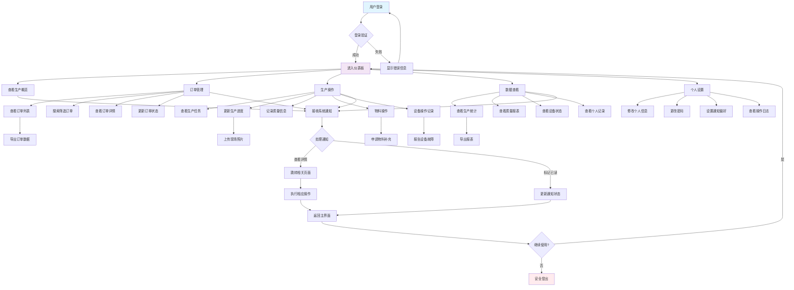
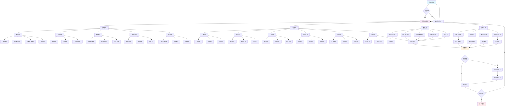

# PMC生产管理系统测试说明

## 1. 系统概述

PMC（Production Management Center）生产管理系统是一个基于Web的生产管理平台，采用前后端分离架构，支持订单管理、生产计划、物料管理、设备管理、质量控制等核心业务功能。

### 1.1 技术架构
- **前端**：Vue.js + Element UI
- **后端**：Python Flask + SQLAlchemy
- **数据库**：PostgreSQL
- **部署**：Docker容器化部署

### 1.2 用户角色
- **系统管理员**：系统配置、用户管理、权限管理
- **业务管理员**：业务流程管理、数据管理、报表管理
- **操作员**：日常生产操作、数据录入、进度更新
- **查看员**：数据查看、报表查看（只读权限）

## 2. 系统功能模块

### 2.1 后端API模块
- **认证模块** (`auth.py`)
  - 用户登录/登出
  - JWT令牌管理
  - 权限验证

- **用户管理模块** (`users.py`)
  - 用户CRUD操作
  - 角色权限管理
  - 用户状态管理

- **订单管理模块** (`orders.py`)
  - 订单创建、修改、删除
  - 订单状态跟踪
  - 订单查询和筛选

- **生产计划模块** (`production_plans.py`)
  - 生产计划制定
  - 计划调整和优化
  - 计划执行监控

- **排产管理模块** (`scheduling.py`)
  - 自动排产算法
  - 手动排产调整
  - 产能分析

- **进度跟踪模块** (`progress.py`)
  - 生产进度实时更新
  - 进度报告生成
  - 异常预警

- **物料管理模块** (`materials.py`)
  - 库存管理
  - 物料需求计划
  - 采购管理

- **设备管理模块** (`equipment.py`)
  - 设备状态监控
  - 维护计划管理
  - 故障报告处理

- **质量管理模块** (`quality.py`)
  - 质量检查记录
  - 质量统计分析
  - 不合格品处理

- **通知系统模块** (`notifications.py`)
  - 系统通知
  - 微信通知
  - 邮件通知

- **催办管理模块** (`reminders.py`)
  - 任务催办
  - 超期提醒
  - 催办统计

- **报表模块** (`reports.py`)
  - 生产报表
  - 质量报表
  - 设备报表
  - 自定义报表

- **数据导入导出模块** (`data_io.py`)
  - Excel导入导出
  - 数据格式验证
  - 批量操作

- **数据备份恢复模块** (`backup.py`)
  - 数据库备份
  - 数据恢复
  - 备份策略管理

- **系统配置模块** (`config.py`)
  - 系统参数配置
  - 业务规则配置
  - 界面个性化配置

### 2.2 前端页面模块
- **仪表板页面** (`Dashboard.vue`)
  - 生产概览
  - 关键指标展示
  - 快捷操作入口

- **登录页面** (`Login.vue`)
  - 用户身份验证
  - 记住登录状态
  - 密码重置

- **订单管理页面** (`OrderManagement.vue`)
  - 订单列表展示
  - 订单详情查看
  - 订单操作功能

- **生产计划页面** (`ProductionPlan.vue`)
  - 计划制定界面
  - 甘特图展示
  - 计划调整功能

- **物料管理页面** (`MaterialManagement.vue`)
  - 库存查看
  - 物料操作
  - 库存预警

- **设备管理页面** (`EquipmentManagement.vue`)
  - 设备状态监控
  - 维护记录管理
  - 设备操作日志

- **质量管理页面** (`QualityManagement.vue`)
  - 质量检查界面
  - 质量统计图表
  - 质量问题跟踪

- **报表页面** (`Reports.vue`)
  - 报表查看
  - 报表生成
  - 报表导出

- **用户管理页面** (`UserManagement.vue`)
  - 用户列表管理
  - 权限分配
  - 用户操作日志

- **系统设置页面** (`Settings.vue`)
  - 系统参数配置
  - 个人设置
  - 系统维护

- **图表展示组件** (`Charts.vue`)
  - 生产趋势图
  - 质量统计图
  - 设备利用率图

### 2.3 数据库模型
- **用户模型** (`User`)
- **订单模型** (`Order`)
- **物料模型** (`Material`)
- **设备模型** (`Equipment`)
- **生产计划模型** (`ProductionPlan`)
- **进度记录模型** (`ProgressRecord`)
- **质量记录模型** (`QualityRecord`)
- **通知模型** (`Notification`)
- **系统配置模型** (`SystemConfig`)

## 3. 待测试模块清单

### 3.1 核心业务模块
1. **用户认证与权限管理**
   - 登录/登出功能
   - 角色权限控制
   - 会话管理
   - 密码安全策略

2. **订单管理**
   - 订单创建、编辑、删除
   - 订单状态流转
   - 订单查询和筛选
   - 订单批量操作

3. **物料管理**
   - 库存管理
   - 物料入库/出库
   - 库存预警
   - 物料需求计划

4. **生产计划**
   - 计划制定
   - 计划调整
   - 计划执行监控
   - 产能分析

5. **排产管理**
   - 自动排产
   - 手动调整
   - 冲突检测
   - 优化建议

6. **进度跟踪**
   - 实时进度更新
   - 进度报告
   - 异常预警
   - 完工确认

7. **设备管理**
   - 设备状态监控
   - 维护计划
   - 故障报告
   - 设备利用率统计

8. **质量管理**
   - 质量检查
   - 质量统计
   - 不合格品处理
   - 质量趋势分析

### 3.2 系统功能模块
9. **通知系统**
   - 系统内通知
   - 微信通知
   - 邮件通知
   - 通知设置管理

10. **催办管理**
    - 任务催办
    - 超期提醒
    - 催办统计
    - 催办规则配置

11. **报表生成**
    - 标准报表
    - 自定义报表
    - 报表导出
    - 报表调度

12. **数据导入导出**
    - Excel导入
    - 数据导出
    - 格式验证
    - 批量处理

13. **数据备份恢复**
    - 自动备份
    - 手动备份
    - 数据恢复
    - 备份策略

14. **系统配置**
    - 参数配置
    - 业务规则
    - 界面定制
    - 系统维护

15. **图表展示**
    - 实时图表
    - 统计图表
    - 趋势分析
    - 交互功能

## 4. 用户测试流程

### 4.1 操作员测试流程

#### 4.1.1 登录和基础操作
1. **系统登录**
   - 打开系统登录页面
   - 输入操作员账号和密码
   - 验证登录成功，进入仪表板
   - 检查用户权限和可访问功能

2. **仪表板功能**
   - 查看生产概览信息
   - 检查待办事项提醒
   - 验证快捷操作按钮
   - 测试数据刷新功能

#### 4.1.2 订单相关操作
3. **订单查看**
   - 进入订单管理页面
   - 查看订单列表
   - 使用搜索和筛选功能
   - 查看订单详细信息

4. **订单操作**
   - 创建新订单（如有权限）
   - 修改订单信息
   - 更新订单状态
   - 添加订单备注

#### 4.1.3 生产操作
5. **生产进度更新**
   - 查看分配的生产任务
   - 更新生产进度
   - 上传现场照片
   - 记录质量信息

6. **物料操作**
   - 查看物料库存
   - 记录物料使用
   - 申请物料补充
   - 报告物料异常

7. **设备操作记录**
   - 记录设备使用情况
   - 报告设备故障
   - 填写设备维护记录
   - 查看设备状态

#### 4.1.4 数据查看和报告
8. **数据查看**
   - 查看生产统计数据
   - 查看质量统计信息
   - 查看设备利用率
   - 查看个人工作记录

9. **报表查看**
   - 查看日报、周报
   - 查看生产进度报表
   - 查看质量报表
   - 导出个人相关报表

### 4.2 查看员测试流程

#### 4.2.1 数据查看权限
1. **登录验证**
   - 使用查看员账号登录
   - 验证只读权限设置
   - 确认无编辑操作按钮

2. **数据浏览**
   - 浏览所有可查看的数据
   - 使用搜索和筛选功能
   - 查看详细信息
   - 验证数据实时性

#### 4.2.2 报表和统计
3. **报表查看**
   - 查看各类统计报表
   - 使用报表筛选功能
   - 导出报表数据
   - 查看图表展示

### 4.3 通用功能测试

#### 4.3.1 个人设置
1. **个人信息管理**
   - 修改个人信息
   - 更改密码
   - 设置个人偏好
   - 查看操作日志

#### 4.3.2 通知系统
2. **通知功能**
   - 接收系统通知
   - 查看通知历史
   - 设置通知偏好
   - 测试通知响应

#### 4.3.3 搜索和筛选
3. **搜索功能**
   - 全局搜索测试
   - 高级筛选功能
   - 搜索结果准确性
   - 搜索性能测试

#### 4.3.4 数据导入导出
4. **数据操作**
   - 导出数据到Excel
   - 导入Excel数据（如有权限）
   - 验证数据格式
   - 测试批量操作

### 4.4 移动端测试

#### 4.4.1 移动端适配
1. **响应式设计**
   - 手机浏览器访问
   - 平板浏览器访问
   - 界面适配测试
   - 触摸操作测试

2. **移动端功能**
   - 移动端登录
   - 核心功能使用
   - 数据同步测试
   - 离线功能测试

### 4.5 异常情况测试

#### 4.5.1 网络异常
1. **网络中断测试**
   - 网络断开时的系统表现
   - 网络恢复后的数据同步
   - 超时处理机制
   - 错误提示信息

#### 4.5.2 数据异常
2. **数据异常处理**
   - 无效数据输入
   - 数据冲突处理
   - 数据丢失恢复
   - 并发操作冲突

### 4.6 性能测试

#### 4.6.1 响应时间
1. **页面加载性能**
   - 首页加载时间
   - 数据查询响应时间
   - 大数据量处理性能
   - 并发用户性能

## 5. 管理员测试流程

### 5.1 系统管理员测试流程

#### 5.1.1 用户和权限管理
1. **用户管理**
   - 创建新用户账号
   - 修改用户信息
   - 禁用/启用用户
   - 重置用户密码
   - 查看用户操作日志

2. **权限管理**
   - 创建和修改角色
   - 分配角色权限
   - 设置功能权限
   - 设置数据权限
   - 测试权限继承

3. **权限验证测试**
   - 验证不同角色的访问权限
   - 测试权限边界
   - 验证权限变更生效
   - 测试权限异常处理

#### 5.1.2 系统配置管理
4. **系统参数配置**
   - 修改系统基础参数
   - 配置业务规则
   - 设置系统限制
   - 配置安全策略

5. **界面配置**
   - 自定义系统界面
   - 配置菜单结构
   - 设置默认页面
   - 配置主题样式

#### 5.1.3 数据库管理
6. **数据库维护**
   - 查看数据库状态
   - 执行数据库优化
   - 管理数据库连接
   - 监控数据库性能

7. **数据备份恢复**
   - 执行手动备份
   - 配置自动备份策略
   - 测试数据恢复功能
   - 验证备份完整性

#### 5.1.4 系统监控
8. **系统状态监控**
   - 查看系统运行状态
   - 监控系统资源使用
   - 查看错误日志
   - 监控用户活动

9. **性能监控**
   - 监控系统响应时间
   - 查看并发用户数
   - 监控数据库性能
   - 分析系统瓶颈

#### 5.1.5 安全管理
10. **安全策略**
    - 配置密码策略
    - 设置会话超时
    - 配置IP访问限制
    - 设置登录失败策略

11. **安全审计**
    - 查看安全日志
    - 分析异常登录
    - 监控权限变更
    - 检查数据访问记录

### 5.2 业务管理员测试流程

#### 5.2.1 订单管理
1. **订单全生命周期管理**
   - 创建和修改订单
   - 审核订单信息
   - 跟踪订单状态
   - 处理订单异常
   - 订单完结处理

2. **订单批量操作**
   - 批量导入订单
   - 批量修改订单
   - 批量状态更新
   - 批量数据导出

#### 5.2.2 生产计划管理
3. **生产计划制定**
   - 制定月度生产计划
   - 制定周度生产计划
   - 制定日度生产计划
   - 计划可行性分析

4. **计划调整和优化**
   - 调整生产计划
   - 优化资源配置
   - 处理计划冲突
   - 应急计划制定

#### 5.2.3 排产管理
5. **排产策略管理**
   - 配置排产规则
   - 设置优先级策略
   - 配置产能参数
   - 设置约束条件

6. **排产执行和监控**
   - 执行自动排产
   - 手动调整排产
   - 监控排产效果
   - 分析排产优化空间

#### 5.2.4 物料管理
7. **物料主数据管理**
   - 创建物料信息
   - 维护物料属性
   - 设置物料分类
   - 配置物料参数

8. **库存管理**
   - 库存盘点管理
   - 库存调整处理
   - 库存预警设置
   - 库存分析报告

#### 5.2.5 设备管理
9. **设备主数据管理**
   - 创建设备档案
   - 维护设备信息
   - 设置设备参数
   - 配置设备分组

10. **设备维护管理**
    - 制定维护计划
    - 安排维护任务
    - 跟踪维护执行
    - 分析维护效果

#### 5.2.6 质量管理
11. **质量标准管理**
    - 制定质量标准
    - 配置检查项目
    - 设置质量参数
    - 维护质量规则

12. **质量过程管理**
    - 质量检查安排
    - 质量问题处理
    - 质量改进跟踪
    - 质量成本分析

#### 5.2.7 通知管理
13. **通知策略配置**
    - 配置通知规则
    - 设置通知模板
    - 配置通知渠道
    - 设置通知频率

14. **通知效果监控**
    - 监控通知发送状态
    - 分析通知响应率
    - 优化通知策略
    - 处理通知异常

#### 5.2.8 催办管理
15. **催办规则配置**
    - 设置催办条件
    - 配置催办频率
    - 设置催办升级
    - 配置催办模板

16. **催办执行监控**
    - 监控催办执行
    - 分析催办效果
    - 处理催办异常
    - 优化催办策略

#### 5.2.9 报表管理
17. **报表配置**
    - 创建自定义报表
    - 配置报表参数
    - 设置报表权限
    - 配置报表调度

18. **报表分析**
    - 生成各类分析报表
    - 进行数据钻取分析
    - 创建管理驾驶舱
    - 制定KPI监控

#### 5.2.10 工作流管理
19. **工作流配置**
    - 设计业务流程
    - 配置审批流程
    - 设置流程节点
    - 配置流程规则

20. **工作流监控**
    - 监控流程执行
    - 处理流程异常
    - 分析流程效率
    - 优化流程设计

### 5.3 高级管理功能测试

#### 5.3.1 数据分析
1. **业务数据分析**
   - 生产效率分析
   - 质量趋势分析
   - 设备利用率分析
   - 成本效益分析

2. **预测分析**
   - 需求预测分析
   - 产能预测分析
   - 质量预测分析
   - 风险预测分析

#### 5.3.2 系统集成
3. **外部系统集成**
   - ERP系统集成测试
   - MES系统集成测试
   - 第三方API集成测试
   - 数据同步测试

4. **接口管理**
   - API接口测试
   - 数据格式验证
   - 接口性能测试
   - 接口安全测试

#### 5.3.3 灾难恢复
5. **灾难恢复测试**
   - 系统故障恢复
   - 数据恢复测试
   - 业务连续性测试
   - 应急预案测试

#### 5.3.4 性能压力测试
6. **系统压力测试**
   - 并发用户压力测试
   - 大数据量处理测试
   - 长时间运行测试
   - 资源消耗测试

## 6. 测试方法和用例

### 6.1 用户认证与权限模块测试

#### 6.1.1 登录功能测试
**测试用例TC001：正常登录**
- **前置条件**：用户账号已创建且状态正常
- **测试步骤**：
  1. 打开登录页面
  2. 输入正确的用户名和密码
  3. 点击登录按钮
- **预期结果**：登录成功，跳转到仪表板页面
- **验证标准**：页面显示用户信息，URL变为仪表板地址

**测试用例TC002：错误密码登录**
- **前置条件**：用户账号存在
- **测试步骤**：
  1. 输入正确用户名和错误密码
  2. 点击登录按钮
- **预期结果**：登录失败，显示错误提示
- **验证标准**：页面显示"用户名或密码错误"提示

**测试用例TC003：账号锁定测试**
- **前置条件**：系统设置连续失败3次锁定账号
- **测试步骤**：
  1. 连续3次输入错误密码
  2. 第4次输入正确密码
- **预期结果**：账号被锁定，无法登录
- **验证标准**：显示"账号已锁定"提示

#### 6.1.2 权限控制测试
**测试用例TC004：角色权限验证**
- **测试数据**：操作员账号
- **测试步骤**：
  1. 以操作员身份登录
  2. 尝试访问管理员功能页面
- **预期结果**：访问被拒绝
- **验证标准**：显示"权限不足"提示或跳转到403页面

### 6.2 订单管理模块测试

#### 6.2.1 订单创建测试
**测试用例TC005：正常创建订单**
- **测试数据**：
  - 客户名称：测试客户A
  - 产品名称：产品001
  - 数量：100
  - 交期：2024-02-01
- **测试步骤**：
  1. 进入订单管理页面
  2. 点击"新建订单"按钮
  3. 填写订单信息
  4. 点击保存
- **预期结果**：订单创建成功
- **验证标准**：
  - 订单列表中显示新订单
  - 订单号自动生成
  - 订单状态为"待确认"

**测试用例TC006：必填字段验证**
- **测试步骤**：
  1. 创建订单时不填写客户名称
  2. 点击保存
- **预期结果**：保存失败，显示验证错误
- **验证标准**：客户名称字段显示红色边框和错误提示

#### 6.2.2 订单查询测试
**测试用例TC007：按订单号查询**
- **前置条件**：系统中存在订单ORD001
- **测试步骤**：
  1. 在搜索框输入"ORD001"
  2. 点击搜索按钮
- **预期结果**：显示匹配的订单
- **验证标准**：列表中只显示订单号为ORD001的记录

### 6.3 物料管理模块测试

#### 6.3.1 库存管理测试
**测试用例TC008：库存入库**
- **测试数据**：
  - 物料编码：MAT001
  - 入库数量：50
  - 入库类型：采购入库
- **测试步骤**：
  1. 进入库存管理页面
  2. 选择物料MAT001
  3. 点击"入库"按钮
  4. 填写入库信息
  5. 确认入库
- **预期结果**：库存数量增加50
- **验证标准**：
  - 物料MAT001库存数量正确更新
  - 生成入库记录
  - 库存变动日志记录正确

**测试用例TC009：库存预警测试**
- **前置条件**：物料MAT002设置最低库存为10
- **测试步骤**：
  1. 将MAT002库存减少至5
  2. 查看预警信息
- **预期结果**：系统显示库存预警
- **验证标准**：
  - 仪表板显示预警信息
  - 发送预警通知
  - 物料列表中MAT002显示预警标识

### 6.4 生产计划模块测试

#### 6.4.1 生产计划创建测试
**测试用例TC010：创建生产计划**
- **测试数据**：
  - 订单号：ORD001
  - 计划开始时间：2024-01-15
  - 计划完成时间：2024-01-25
  - 生产数量：100
- **测试步骤**：
  1. 进入生产计划页面
  2. 选择订单ORD001
  3. 填写计划信息
  4. 保存计划
- **预期结果**：生产计划创建成功
- **验证标准**：
  - 计划列表显示新计划
  - 计划状态为"待开始"
  - 关联订单状态更新为"已排产"

### 6.5 进度跟踪模块测试

#### 6.5.1 进度更新测试
**测试用例TC011：更新生产进度**
- **前置条件**：存在进行中的生产任务
- **测试数据**：
  - 完成数量：30
  - 完成百分比：30%
  - 质量状态：合格
- **测试步骤**：
  1. 进入进度跟踪页面
  2. 选择生产任务
  3. 更新进度信息
  4. 上传现场照片
  5. 提交更新
- **预期结果**：进度更新成功
- **验证标准**：
  - 进度条显示30%
  - 完成数量更新为30
  - 照片成功上传
  - 生成进度记录

### 6.6 设备管理模块测试

#### 6.6.1 设备状态管理测试
**测试用例TC012：设备故障报告**
- **测试数据**：
  - 设备编号：EQP001
  - 故障描述：电机异响
  - 故障等级：中等
- **测试步骤**：
  1. 进入设备管理页面
  2. 选择设备EQP001
  3. 点击"故障报告"
  4. 填写故障信息
  5. 提交报告
- **预期结果**：故障报告提交成功
- **验证标准**：
  - 设备状态变为"故障"
  - 生成故障工单
  - 发送故障通知给维修人员
  - 设备在生产计划中标记为不可用

### 6.7 质量管理模块测试

#### 6.7.1 质量检查测试
**测试用例TC013：质量检查记录**
- **测试数据**：
  - 检查批次：BATCH001
  - 检查项目：外观检查
  - 检查结果：合格
  - 检查数量：50
  - 合格数量：48
- **测试步骤**：
  1. 进入质量管理页面
  2. 创建质量检查记录
  3. 填写检查信息
  4. 上传检查照片
  5. 提交记录
- **预期结果**：质量检查记录创建成功
- **验证标准**：
  - 合格率计算正确（96%）
  - 不合格品自动标记
  - 质量统计数据更新
  - 如合格率低于标准，触发质量预警

### 6.8 通知系统模块测试

#### 6.8.1 通知发送测试
**测试用例TC014：系统通知发送**
- **测试数据**：
  - 通知类型：生产异常
  - 接收人：生产经理
  - 通知内容：设备EQP001发生故障
- **测试步骤**：
  1. 触发设备故障事件
  2. 系统自动发送通知
  3. 检查通知接收情况
- **预期结果**：通知发送成功
- **验证标准**：
  - 系统内通知显示
  - 微信通知发送成功
  - 邮件通知发送成功
  - 通知状态标记为已发送

### 6.9 数据导入导出模块测试

#### 6.9.1 Excel导入测试
**测试用例TC015：批量导入订单**
- **测试数据**：包含10条订单记录的Excel文件
- **测试步骤**：
  1. 进入订单管理页面
  2. 点击"导入"按钮
  3. 选择Excel文件
  4. 预览导入数据
  5. 确认导入
- **预期结果**：订单批量导入成功
- **验证标准**：
  - 10条订单全部导入
  - 数据格式正确
  - 重复数据被识别
  - 生成导入日志

**测试用例TC016：导入数据验证**
- **测试数据**：包含错误数据的Excel文件
- **测试步骤**：
  1. 导入包含格式错误的Excel文件
  2. 查看验证结果
- **预期结果**：系统识别并提示错误
- **验证标准**：
  - 显示具体错误信息
  - 标记错误行号
  - 提供修正建议
  - 允许修正后重新导入

### 6.10 报表生成模块测试

#### 6.10.1 报表生成测试
**测试用例TC017：生产报表生成**
- **测试参数**：
  - 报表类型：月度生产报表
  - 时间范围：2024年1月
  - 输出格式：PDF
- **测试步骤**：
  1. 进入报表管理页面
  2. 选择生产报表
  3. 设置报表参数
  4. 生成报表
  5. 下载报表文件
- **预期结果**：报表生成成功
- **验证标准**：
  - 报表数据准确
  - 图表显示正确
  - PDF格式正常
  - 文件可正常下载

## 7. 测试环境要求

### 7.1 硬件环境
- **服务器**：CPU 4核，内存8GB，硬盘100GB
- **客户端**：Windows 10/11，Chrome/Edge浏览器
- **移动端**：Android 8.0+，iOS 12.0+

### 7.2 软件环境
- **操作系统**：Windows Server 2019/Linux Ubuntu 20.04
- **数据库**：PostgreSQL 13+
- **Web服务器**：Nginx 1.18+
- **Python环境**：Python 3.9+

### 7.3 测试数据准备
- **用户数据**：各角色测试账号各5个
- **基础数据**：客户100个，物料200个，设备50台
- **业务数据**：订单500个，生产计划100个
- **历史数据**：近6个月的生产记录

## 8. 测试执行标准

### 8.1 功能测试标准
- **通过率**：≥95%
- **响应时间**：页面加载≤3秒，查询≤5秒
- **数据准确性**：100%
- **界面兼容性**：支持主流浏览器

### 8.2 性能测试标准
- **并发用户**：支持100个并发用户
- **系统可用性**：≥99.5%
- **数据库响应**：查询≤2秒
- **文件上传**：≤10MB文件上传时间≤30秒

### 8.3 安全测试标准
- **权限控制**：100%有效
- **数据加密**：敏感数据全部加密
- **会话管理**：超时自动登出
- **SQL注入防护**：100%防护

## 9. 缺陷管理标准

### 9.1 缺陷等级定义
- **严重**：系统崩溃、数据丢失、安全漏洞
- **高**：主要功能无法使用、数据错误
- **中**：次要功能异常、界面问题
- **低**：文字错误、界面美化建议

### 9.2 缺陷处理要求
- **严重缺陷**：24小时内修复
- **高级缺陷**：3个工作日内修复
- **中级缺陷**：1周内修复
- **低级缺陷**：下个版本修复

## 10. 系统使用流程图

### 10.1 用户版系统使用流程图

### 10.2 管理员版系统使用流程图

### 10.3 流程图说明

#### 10.3.1 用户版流程图特点
- **简化操作流程**：突出日常操作的便捷性
- **权限限制明确**：只显示用户可访问的功能
- **任务导向**：以完成具体生产任务为主线
- **通知响应**：强调及时响应系统通知

#### 10.3.2 管理员版流程图特点
- **全面管理视角**：涵盖系统、业务、数据、监控四大管理领域
- **决策支持导向**：通过数据分析支持管理决策
- **系统维护重点**：强调系统稳定性和安全性
- **持续优化循环**：体现持续改进的管理理念

#### 10.3.3 流程图使用说明
1. **测试参考**：测试人员可按流程图设计测试路径
2. **培训材料**：可作为用户培训的参考资料
3. **功能验证**：确保所有流程节点功能正常
4. **用户体验**：验证用户操作的便捷性和逻辑性

## 11. 测试计划和进度

### 11.1 测试阶段安排
1. **第一阶段**：核心功能测试（1周）
   - 用户认证与权限
   - 订单管理
   - 物料管理
   - 生产计划

2. **第二阶段**：业务流程测试（1周）
   - 进度跟踪
   - 设备管理
   - 质量管理
   - 通知系统

3. **第三阶段**：系统功能测试（1周）
   - 报表生成
   - 数据导入导出
   - 系统配置
   - 图表展示

4. **第四阶段**：集成和性能测试（1周）
   - 系统集成测试
   - 性能压力测试
   - 安全测试
   - 用户验收测试

### 10.2 测试人员安排
- **测试经理**：1人，负责测试计划和协调
- **功能测试工程师**：3人，负责功能测试
- **性能测试工程师**：1人，负责性能测试
- **安全测试工程师**：1人，负责安全测试
- **业务用户代表**：2人，参与用户验收测试

### 10.3 测试交付物
- 测试计划文档
- 测试用例文档
- 测试执行报告
- 缺陷报告
- 测试总结报告
- 用户验收报告

---

**文档版本**：V1.0  
**创建日期**：2025年7月30日  
**最后更新**：2025年7月30日  
**文档状态**：正式版